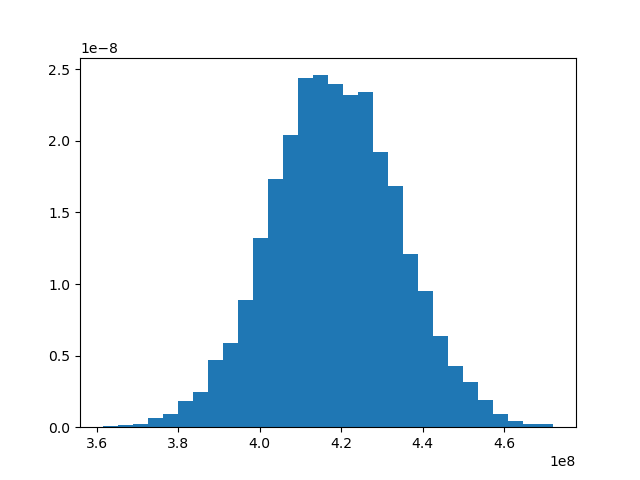

# Cloud Storage Ingestion Cost Estimation for Big Data using Monte Carlo Simulation over CUDA libraries and NVIDIA Tesla GPU

In this post I am going to use CUDA DataFrame API (cuDF) and Tesla GPU (P100) to
do statistical cost analysis using famous [Monte Carlo simulation](https://en.wikipedia.org/wiki/Monte_Carlo_method)

## Objective
In this example I am planning to estimate cost **range** with probabilities of a cloud ingestion,
based on historical data processing patters throughout the year. 

The plan is to use estimated daily data volume and simulate it over and over 
to get normal distribution (Monte Carlo) of the cost that can be used to estimate annual cost
of the ingestion that is often required by companies to do yearly cost planning.

Here assumption is that we ingest around 100 billion records throughout the day of various record sizes. 
And I also use a price per Gb for given Cloud provider to calculate total cost per day. 
In this case I picked up Azure Premium Storage Write cost which is £0.0231 per GB for UK South region.   

### Environment

Here I am using following distinctive toolsets (soft/hard):

- NVIDIA GPU (Tesla P100) 
- cuDF - RAPIDS API
- Jupiter notebook
- Ubuntu 20.4

#### Notebook

_You can download below notebook [here](https://github.com/khalidmammadov/python_code/blob/master/notebooks/CloudStorageCostAnalysis_RAPIDS.ipynb)._

Start the Jupiter as usual:
```
jupyter-lab --allow-root --ip='0.0.0.0' --NotebookApp.token='aaaa'
```

Import all required packages:
```python
import cudf
import numpy as np
import matplotlib.pyplot as plt
import asyncio
```

### Generate input data 

In order to generate data I am going to define function that takes 
mean and standard deviation and generates random data using Normal Distribution
with given sample size. 

```python
mu = 100 # Billion
days = 365
def gen_data(mean, std_dev, count):
    return np.abs(np.random.normal(mean, std_dev, count))
```

First generate sample records that calibrates around 100 billion
to simulate different record counts for different days.
```python
rows = np.round(gen_data(mu, 50, days), 0) * 1e9
rows[:50]
```
```text
array([2.12e+11, 1.34e+11, 1.17e+11, 1.49e+11, 1.78e+11, 3.80e+10,
       1.36e+11, 1.00e+11, 4.10e+10, 1.32e+11, 1.05e+11, 1.78e+11,
       1.14e+11, 4.40e+10, 6.90e+10, 1.05e+11, 3.30e+10, 1.19e+11,
       5.80e+10, 6.00e+09, 1.43e+11, 1.31e+11, 7.50e+10, 4.20e+10,
       6.80e+10, 1.67e+11, 1.03e+11, 8.40e+10, 1.07e+11, 7.40e+10,
       1.92e+11, 1.12e+11, 1.02e+11, 6.90e+10, 7.70e+10, 1.36e+11,
       1.16e+11, 1.21e+11, 1.34e+11, 1.25e+11, 1.03e+11, 1.70e+11,
       1.91e+11, 1.23e+11, 1.50e+11, 3.40e+10, 1.31e+11, 1.86e+11,
       6.10e+10, 1.58e+11])
```

Then generate different record sizes and again taking into account element of randomness 
```python
size_kb = gen_data(1, 0.5, days)
size_kb[:50]
```
```text
array([0.6368345 , 0.53845971, 0.59993506, 0.56915304, 0.40233333,
       1.95551984, 1.26749983, 0.40315177, 1.59453739, 0.9977041 ,
       1.1700193 , 0.75225312, 0.06423521, 0.43733229, 0.53207042,
       0.36510346, 1.66771478, 0.90867772, 0.86687966, 0.75003732,
       0.814253  , 1.05945731, 0.94909614, 0.07750137, 1.19475339,
       0.76291239, 0.82643234, 0.46363452, 1.85141784, 1.22141825,
       1.50350416, 0.91429837, 1.8167039 , 1.72516134, 1.19922491,
       1.77885785, 1.09000296, 0.99389852, 0.94640651, 1.12030288,
       0.89005732, 1.86714622, 1.28658232, 1.14080763, 0.67728014,
       1.73211748, 0.67629164, 1.78840555, 1.63874132, 1.81057046])
```

Now, lets create CUDA DataFrame (which is very similar to Pandas one)
```python
cdf = cudf.DataFrame({"rows": rows, "size": size_kb})
type(cdf)
```
```text
cudf.core.dataframe.DataFrame
```

Then lets compute total size in Gb and total cost using unit price from a cloud provider 
I mentioned at the beginning:
```python
cdf["total_size_gb"] = np.round((cdf["rows"] * cdf["size"])/1024/1024)
cdf["cost"] = cdf["total_size_gb"] * 0.0231
```

Lets see how data now looks like. Please note that data is located inside GPU memory and not in the RAM.
```text
rows 	size 	total_size_gb 	cost
0 	8.000000e+10 	1.082932 	82621.0 	1908.5451
1 	1.930000e+11 	0.571516 	105193.0 	2429.9583
2 	1.380000e+11 	0.308074 	40545.0 	936.5895
3 	1.020000e+11 	0.824643 	80217.0 	1853.0127
4 	1.360000e+11 	0.990358 	128449.0 	2967.1719
... 	... 	... 	... 	...
360 	9.800000e+10 	0.365040 	34117.0 	788.1027
361 	1.430000e+11 	1.253338 	170924.0 	3948.3444
362 	1.100000e+11 	1.117580 	117239.0 	2708.2209
363 	1.430000e+11 	0.348529 	47531.0 	1097.9661
364 	1.760000e+11 	0.064562 	10836.0 	250.3116

365 rows × 4 columns
```

Let's also plot total cost to see how it varies:
```text
fig = plt.figure()
ax = fig.add_subplot()
ax.plot(cdf["cost"])
```


## Monte Carlo simulation

In order to do Monte Carlo simulation I am going to use Python's asyncio library and run 
above instructions in parallel for 100000 years!

```python
mu = 100 # Billion
days = 365
def gen_data(mean, std_dev, count):
    return np.abs(np.random.normal(mean, std_dev, count))

# Monte Carlo
years = 100000
price_per_gb = 0.15214
async def generate_sample_sum():
    rows = np.round(gen_data(mu, 50, days), 0)*1e9
    size_kb = gen_data(1, 0.5, days)
    cdf = cudf.DataFrame({"rows": rows, "size": size_kb})
    cdf["total_size_gb"] = np.round((cdf["rows"] * cdf["size"])/(1024*2))
    cdf["cost"] = cdf["total_size_gb"] * price_per_gb
    return cdf["cost"].sum()
```

Run calculation in parallel:
```python
estimates = await asyncio.gather(*[generate_sample_sum() for _ in range(years)])
```
This will cause all calculations to be run in parallel on the GPU. As you can see it only uses 7% of the GPU
with only 530Mb (3%) to do calculations


## Result

Lets plot collected results and see outcomes:

```python
fig = plt.figure()
ax = fig.add_subplot()
ax.hist(estimates, 30, density=True)
fig.savefig("storage_cost_simulation_result")
```

Below is histogram of simulation results for 10000 years! Here x axis in pounds (million)


Using this simulation one can calculate possible range of annual cost estimations with 
probabilities and that can be used to make cloud ingestion cost estimations for annual planning. 
