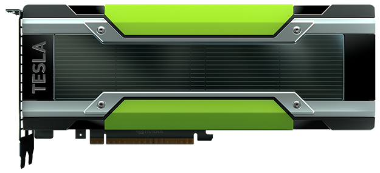
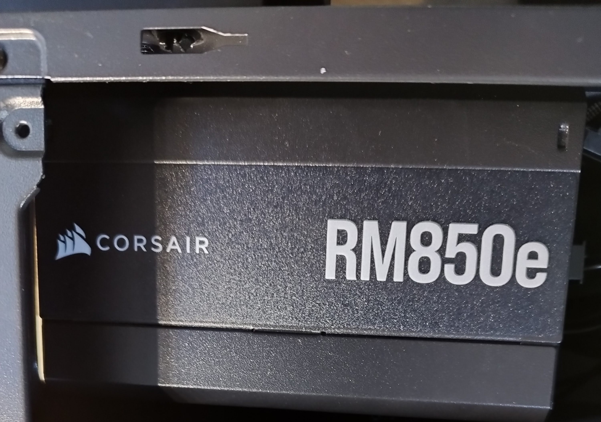
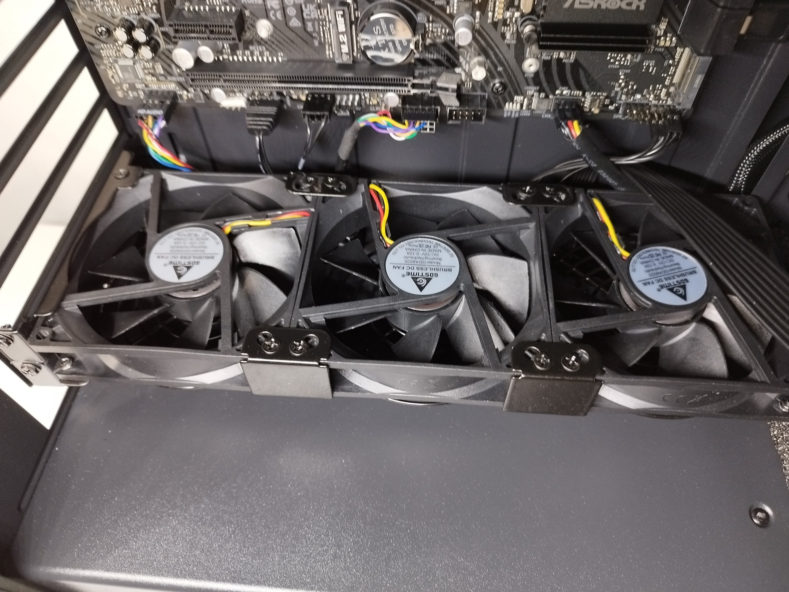
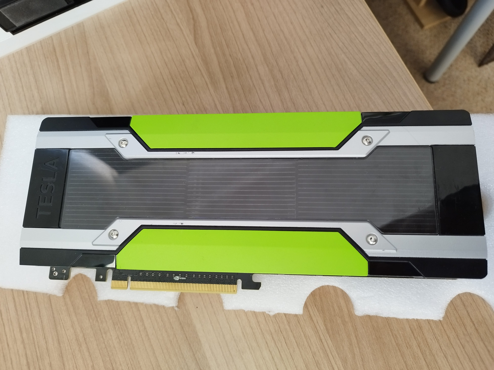
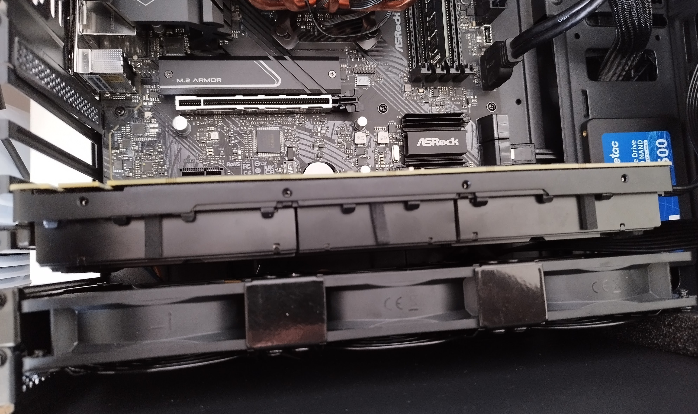
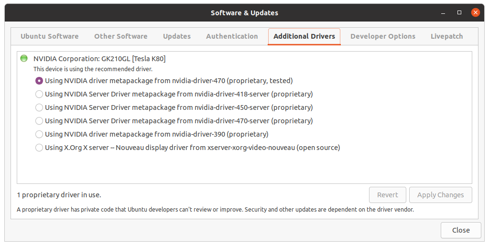
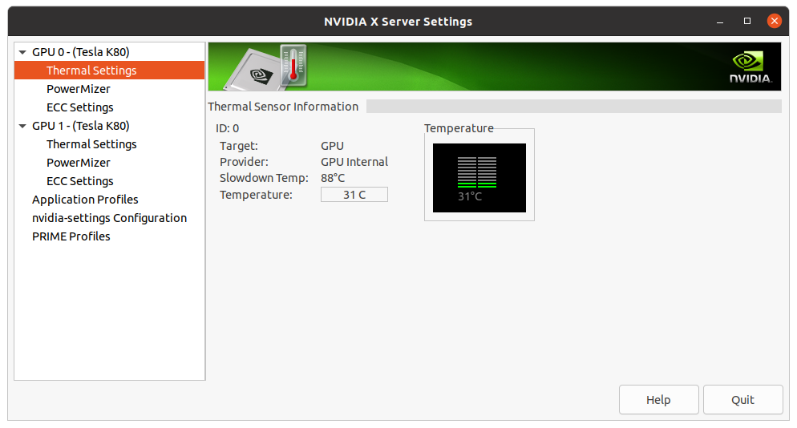
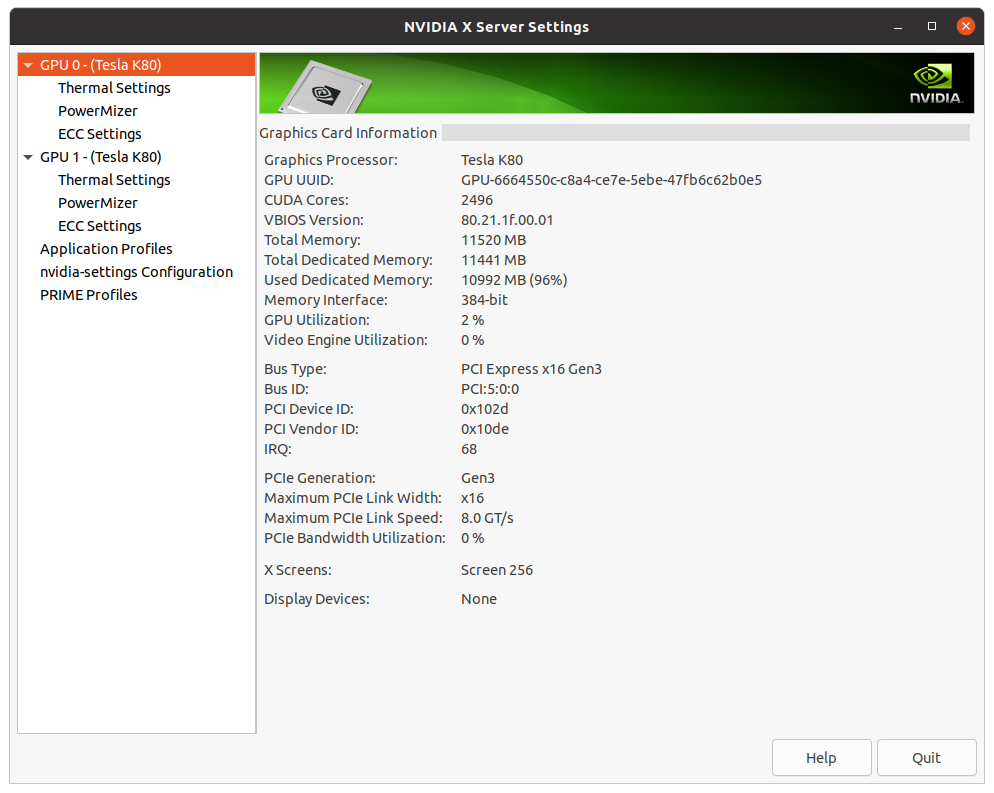

# Installing NVIDIA Tesla K80 GPU on a workstation for Deep Learning

Here I am installing NVIDIA GPU to my home workstation for doing some Deep Learning experimentation tasks.
I am using old but popular Tesla K80 GPU which I purchased second hand from eBay. 
K80 actually has 2 GPUs on the board with 24Gb memory and 4992 NVIDIA CUDA cores.
[More info](https://www.techpowerup.com/gpu-specs/tesla-k80.c2616) 



## Requirements

Although installation is not complex, few things needs to be considered:

- GPU itself
- ATX mother board
- Minimum 700Wat PSU
- Free PCIe Gen3 slot
- Free 6pin CPU cable
- Custom GPU cooler
- Linux OS

Based on this my home workstation configuration is as below:
- GPU: NVIDIA Tesla K80
- Motherboard: ASRock B550 AM4
- CPU: AMD Ryzen 7 5700G
- RAM: 16Gb
- PSU: Corsair RM850e
- GPU Cooler: GDSTIME Brushless DC Fan
- Ubuntu: 20.4 

### BIOS
You will most likely need to touch few configs in the BIOS. For me they were below:

- Advanced\PCI Configuration\Above 4G Decoding: Enabled
- Advanced\AMD PBS\ Graphics Features\Primary Video Adapter: Int Graphics (IGD)

### PSU 

It's necessary to enough power to drive this GPU which requires 300W, otherwise 
PC will not even start. So, I have purchased **Corsair RM850e** with 850Wats that is enough for
this GPU. This modular PSU and provides necessary cables including one that says CPU that's required 
for it.


### Installation

I first installed cooler just below the PCIs slot, so it can blow directly onto the GPU:


Here is my used K80


Below is my actual Tesla K80 installed. I needed to take off top cover, so I can expose heat sink for fan to blow onto it. 
GPU went into free PCIe slot inside the motherboard. And below you can see it



### Software
I also needed to install additional software to make it work on my system.

#### Drivers
Installing NVIDIA GPU drivers for this specific model was done very easily from 
Software & Updates on Ubuntu:


#### Monitoring UI

NVIDIA provides "NVIDIA X Server Settings" graphical UI that conveniently shows what GPUs I have 
on the system:


As you can see I have got 2 GPUs are active and ready to do some work. Also you can see conveniently
the temperature it's running on which is ok taking account nothing is running on it now!

You can also get the same information using **nvidia-smi** command line tool:
```bash
(base) khalid@workstation:~/gpu$ nvidia-smi
Thu Jan 26 22:35:17 2023       
+-----------------------------------------------------------------------------+
| NVIDIA-SMI 470.161.03   Driver Version: 470.161.03   CUDA Version: 11.4     |
|-------------------------------+----------------------+----------------------+
| GPU  Name        Persistence-M| Bus-Id        Disp.A | Volatile Uncorr. ECC |
| Fan  Temp  Perf  Pwr:Usage/Cap|         Memory-Usage | GPU-Util  Compute M. |
|                               |                      |               MIG M. |
|===============================+======================+======================|
|   0  Tesla K80           Off  | 00000000:05:00.0 Off |                    0 |
| N/A   31C    P8    26W / 149W |      8MiB / 11441MiB |      0%      Default |
|                               |                      |                  N/A |
+-------------------------------+----------------------+----------------------+
|   1  Tesla K80           Off  | 00000000:06:00.0 Off |                    0 |
| N/A   32C    P8    30W / 149W |      8MiB / 11441MiB |      0%      Default |
|                               |                      |                  N/A |
+-------------------------------+----------------------+----------------------+
                                                                               
+-----------------------------------------------------------------------------+
| Processes:                                                                  |
|  GPU   GI   CI        PID   Type   Process name                  GPU Memory |
|        ID   ID                                                   Usage      |
|=============================================================================|
|    0   N/A  N/A      1145      G   /usr/lib/xorg/Xorg                  3MiB |
|    0   N/A  N/A      1996      G   /usr/lib/xorg/Xorg                  3MiB |
|    1   N/A  N/A      1145      G   /usr/lib/xorg/Xorg                  3MiB |
|    1   N/A  N/A      1996      G   /usr/lib/xorg/Xorg                  3MiB |
+-----------------------------------------------------------------------------+
```


#### CUDA toolkit
I have choosen this to match above supported CUDA version so:
```bash
wget https://developer.download.nvidia.com/compute/cuda/repos/ubuntu2004/x86_64/cuda-ubuntu2004.pin
sudo mv cuda-ubuntu2004.pin /etc/apt/preferences.d/cuda-repository-pin-600
wget https://developer.download.nvidia.com/compute/cuda/11.4.0/local_installers/cuda-repo-ubuntu2004-11-4-local_11.4.0-470.42.01-1_amd64.deb
sudo dpkg -i cuda-repo-ubuntu2004-11-4-local_11.4.0-470.42.01-1_amd64.deb
sudo apt-key add /var/cuda-repo-ubuntu2004-11-4-local/7fa2af80.pub
sudo apt-get -y install cuda
```

## Deep Learning test with TensorFlow

Now I am ready to run Deep Learning test on my GPU. I am using an example from
[TensorFlow web site](https://www.tensorflow.org/guide/core/quickstart_core). 

```python
import tensorflow as tf
import time
import pandas as pd
import matplotlib
from matplotlib import pyplot as plt

print(tf.config.list_physical_devices('GPU'))
print("TensorFlow version:", tf.__version__)
# Set a random seed for reproducible results
tf.random.set_seed(22)

url = 'http://archive.ics.uci.edu/ml/machine-learning-databases/auto-mpg/auto-mpg.data'
column_names = ['MPG', 'Cylinders', 'Displacement', 'Horsepower', 'Weight',
                'Acceleration', 'Model Year', 'Origin']


def main():
    dataset = pd.read_csv(url, names=column_names, na_values='?', comment='\t', sep=' ', skipinitialspace=True)

    dataset = dataset.dropna()
    dataset_tf = tf.convert_to_tensor(dataset, dtype=tf.float32)
    dataset.tail()

    dataset_shuffled = tf.random.shuffle(dataset_tf, seed=22)
    train_data, test_data = dataset_shuffled[100:], dataset_shuffled[:100]
    x_train, y_train = train_data[:, 1:], train_data[:, 0]
    x_test, y_test = test_data[:, 1:], test_data[:, 0]

    def onehot_origin(x):
        origin = tf.cast(x[:, -1], tf.int32)
        # Use `origin - 1` to account for 1-indexed feature
        origin_oh = tf.one_hot(origin - 1, 3)
        x_ohe = tf.concat([x[:, :-1], origin_oh], axis = 1)
        return x_ohe

    x_train_ohe, x_test_ohe = onehot_origin(x_train), onehot_origin(x_test)
    x_train_ohe.numpy()

    class Normalize(tf.Module):
        def __init__(self, x):
            # Initialize the mean and standard deviation for normalization
            self.mean = tf.math.reduce_mean(x, axis=0)
            self.std = tf.math.reduce_std(x, axis=0)

        def norm(self, x):
            # Normalize the input
            return (x - self.mean)/self.std

        def unnorm(self, x):
            # Unnormalize the input
            return (x * self.std) + self.mean

    norm_x = Normalize(x_train_ohe)
    norm_y = Normalize(y_train)
    x_train_norm, y_train_norm = norm_x.norm(x_train_ohe), norm_y.norm(y_train)
    x_test_norm, y_test_norm = norm_x.norm(x_test_ohe), norm_y.norm(y_test)

    class LinearRegression(tf.Module):

        def __init__(self):
            self.built = False

        @tf.function
        def __call__(self, x):
            # Initialize the model parameters on the first call
            if not self.built:
                # Randomly generate the weight vector and bias term
                rand_w = tf.random.uniform(shape=[x.shape[-1], 1])
                rand_b = tf.random.uniform(shape=[])
                self.w = tf.Variable(rand_w)
                self.b = tf.Variable(rand_b)
                self.built = True
            y = tf.add(tf.matmul(x, self.w), self.b)
            return tf.squeeze(y, axis=1)

    lin_reg = LinearRegression()
    prediction = lin_reg(x_train_norm[:1])
    prediction_unnorm = norm_y.unnorm(prediction)
    prediction_unnorm.numpy()

    def mse_loss(y_pred, y):
        return tf.reduce_mean(tf.square(y_pred - y))

    batch_size = 6400
    train_dataset = tf.data.Dataset.from_tensor_slices((x_train_norm, y_train_norm))
    train_dataset = train_dataset.shuffle(buffer_size=x_train.shape[0]).batch(batch_size)
    test_dataset = tf.data.Dataset.from_tensor_slices((x_test_norm, y_test_norm))
    test_dataset = test_dataset.shuffle(buffer_size=x_test.shape[0]).batch(batch_size)

    # Set training parameters
    epochs = 10000
    learning_rate = 0.01
    train_losses, test_losses = [], []

    # Format training loop
    for epoch in range(epochs):
        batch_losses_train, batch_losses_test = [], []

        # Iterate through the training data
        for x_batch, y_batch in train_dataset:
            with tf.GradientTape() as tape:
                y_pred_batch = lin_reg(x_batch)
                batch_loss = mse_loss(y_pred_batch, y_batch)
            # Update parameters with respect to the gradient calculations
            grads = tape.gradient(batch_loss, lin_reg.variables)
            for g, v in zip(grads, lin_reg.variables):
                v.assign_sub(learning_rate * g)
            # Keep track of batch-level training performance
            batch_losses_train.append(batch_loss)

        # Iterate through the testing data
        for x_batch, y_batch in test_dataset:
            y_pred_batch = lin_reg(x_batch)
            batch_loss = mse_loss(y_pred_batch, y_batch)
            # Keep track of batch-level testing performance
            batch_losses_test.append(batch_loss)

        # Keep track of epoch-level model performance
        train_loss = tf.reduce_mean(batch_losses_train)
        test_loss = tf.reduce_mean(batch_losses_test)
        train_losses.append(train_loss)
        test_losses.append(test_loss)
        if epoch % 10 == 0:
            print(f'Mean squared error for step {epoch}: {train_loss.numpy():0.3f}')

    # Output final losses
    print(f"\nFinal train loss: {train_loss:0.3f}")
    print(f"Final test loss: {test_loss:0.3f}")

    matplotlib.rcParams['figure.figsize'] = [9, 6]

    plt.plot(range(epochs), train_losses, label="Training loss")
    plt.plot(range(epochs), test_losses, label="Testing loss")
    plt.xlabel("Epoch")
    plt.ylabel("Mean squared error loss")
    plt.legend()
    plt.title("MSE loss vs training iterations")


if __name__ == "__main__":
    tic = time.perf_counter()
    main()
    toc = time.perf_counter()
    print(f"Diff {toc - tic:0.4f} seconds")
```

And below shows the load on the first GPU 0. It only used 2% GPU but all memory to do the task: 


The output of the run:
```bash
[PhysicalDevice(name='/physical_device:GPU:0', device_type='GPU'), PhysicalDevice(name='/physical_device:GPU:1', device_type='GPU')]
TensorFlow version: 2.11.0
.....
Mean squared error for step 9950: 0.169
Mean squared error for step 9960: 0.169
Mean squared error for step 9970: 0.169
Mean squared error for step 9980: 0.169
Mean squared error for step 9990: 0.169

Final train loss: 0.169
Final test loss: 0.167
Diff 75.9352 seconds
```

## Conclusion
This post should show how it's easy (arguable) to install a GPU into your home set up
for various ML tasks.