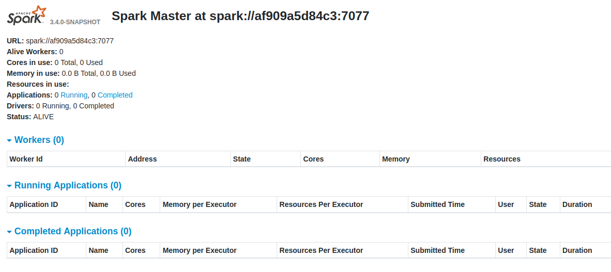
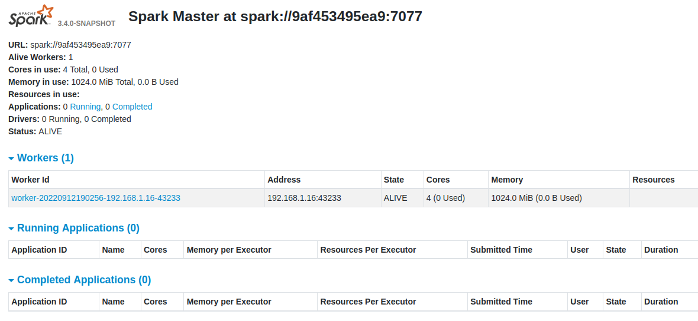
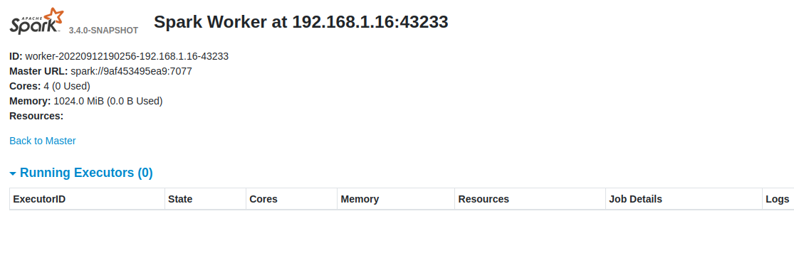
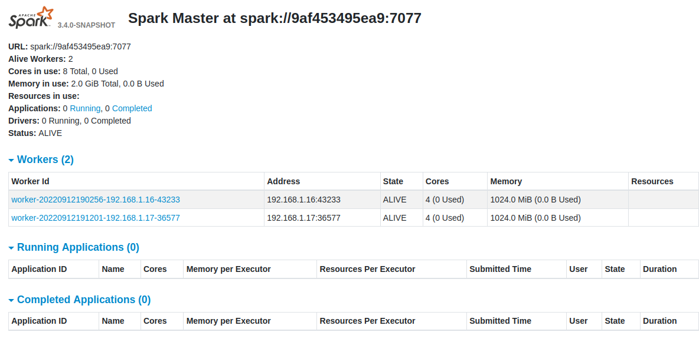
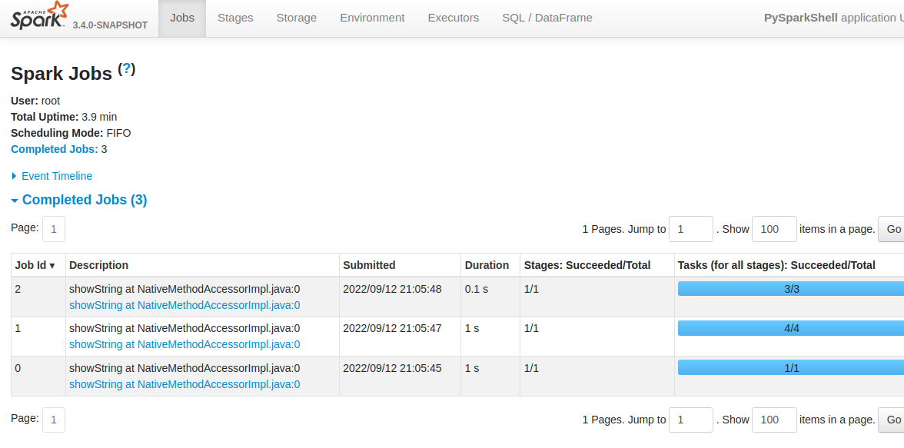
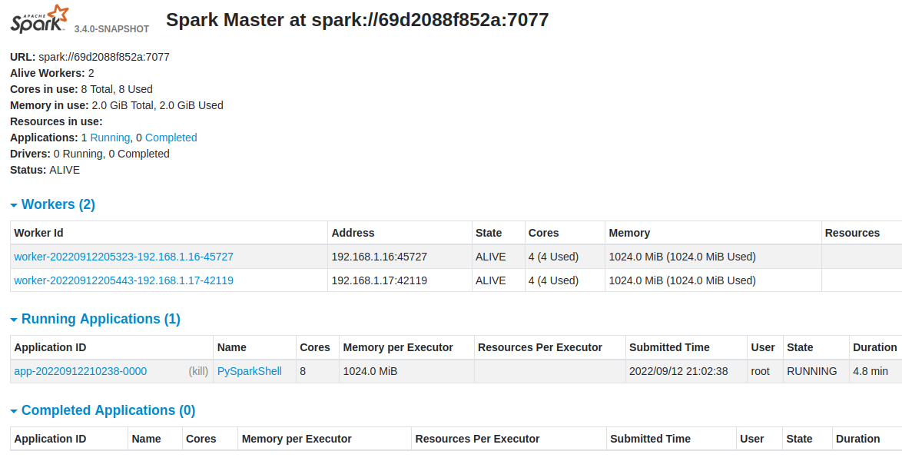

# Building latest (SNAPSHOT) Spark and running on Standalone Docker Cluster
```python
      ____              __
     / __/__  ___ _____/ /__
    _\ \/ _ \/ _ `/ __/  '_/
   /__ / .__/\_,_/_/ /_/\_\   version 3.4.0-SNAPSHOT
      /_/

```

## Overview
Here I'm going to build Spark from source code and package it into a Docker image 
and set up a small cluster to demonstrate how it's easy to get latest Spark up and running.

Although, it's easy to have a separate network for the cluster, 
I'm going to run it on a local network so I can access web UIs easily.

## Setup
In order to have cluster on local network I will use [MACVLAN](https://docs.docker.com/network/macvlan/) network 
for Docker. 
Below is the setup. It will create a new network that all containers can attach to.
```python
docker network create -d macvlan --subnet=192.168.1.0/24 --gateway=192.168.1.254 -o parent=eth0 pub_net
```
The good thing about MACVLAN network is that it will make containers accessible from any device in the local network.
(though not really for PROD use case and there are many more options available for PROD, check Docker networking docs)

### Repo
In order to build a Spark Docker image you will need a `Dockerfile` 
which can be downloaded from below link or just clone the repo:
```python
https://github.com/khalidmammadov/docker/blob/main/spark_docker_standalone_cluster/Dockerfile
```
**Note**: If you are curious as to why image is based on `dongjoon/apache-spark-github-action-image:20220207`
, this the same image used for Spark CI builds on Github (also Dongjoon is Spark PMC member)

### Spark
Ofcourse, we also need latest Spark source code and that can be downloaded or cloned from:
```python
git clone https://github.com/apache/spark.git
```

## Build
Assuming both Dockerfile and spark folder in your current dir lets build it.
So you should have following folder elements:
```python
khalid@ubuntu:~/docker$ ll
drwxrwxr-x 3 khalid khalid      4096 Sep 12 18:49 ./
drwxrwxr-x 4 khalid khalid      4096 Sep 12 18:49 ../
-rw-rw-r-- 1 khalid khalid       838 Sep 12 18:38 Dockerfile
drwxrwxr-x 2 khalid khalid      4096 Sep 12 18:49 spark/
```
Lets add spark into archive first as it seems to speed up build
```python
tar -czf spark.tgz -C ./spark/ .
```
Now we are ready to build image and Spark! (lets time it as well). 
```python
time docker build -f Dockerfile -t spark_build:0.1 .
```
It will start downloading required packages, java etc. and set up build environment for Spark 
and start building Spark! It will take a while depending of your PC, for me it took around 25min.


## Start up
Now we can start cluster containers and I am going to have one container per component i.e. 
one for Master, Worker(one for each) and test Application.

### Master
Let's start a master container with below command and go inside the container:
```shell
# Assign a static IP from our network to our Master so we can join other workers and view WebUI
# You can choose any IP from above MACVLAN subnet we created earlier 
khalid@ubuntu:~/docker$ export SPARK_MASTER_IP=192.168.15
khalid@ubuntu:~/docker$ docker run \
                        -it \
                        --rm \
                        --name master \
                        -p 8080:8080 \
                        --ip=$SPARK_MASTER_IP \
                        -e SPARK_LOCAL_IP=$SPARK_MASTER_IP \
                        --net pub_net \
                        spark_build:0.1
```
Let's go through each flag to clarify things:
- `-it` will start container and attach terminal to it
- `--rm` will remove container once stopped (I dont need it after the demo)
- `--name` give nice name to the container 
- `-p` expose and map this port to IP so we can see Spark Master Web UI
- `--ip=$SPARK_MASTER_IP ` this will assign an IP to our container in our network
- `-e SPARK_LOCAL_IP=$SPARK_MASTER_IP` this sets environment variable for container and 
Spark will use this IP to bind to and it will become a "Spark Master" IP

- `--net pub_net` instruct container to attach this MACVLAN network
- `spark_build:0.1` use image we built earlier

Now we can start Spark Master:
```shell
root@9af453495ea9:/home/spark# ./sbin/start-master.sh 
starting org.apache.spark.deploy.master.Master, logging to /home/spark/logs/spark--org.apache.spark.deploy.master.Master-1-9af453495ea9.out
```
This will start our master at given IP.

We can check the logs to confirm it's started:
```shell
root@9af453495ea9:/home/spark# cat /home/spark/logs/spark--org.apache.spark.deploy.master.Master-1-9af453495ea9.out
Spark Command: /usr/lib/jvm/java-8-openjdk-amd64/jre/bin/java -cp /home/spark/conf/:/home/spark/assembly/target/scala-2.12/jars/* -Xmx1g org.apache.spark.deploy.master.Master --host 9af453495ea9 --port 7077 --webui-port 8080
========================================
Using Spark's default log4j profile: org/apache/spark/log4j2-defaults.properties
22/09/12 18:44:01 INFO Master: Started daemon with process name: 22@9af453495ea9
22/09/12 18:44:01 INFO SignalUtils: Registering signal handler for TERM
22/09/12 18:44:01 INFO SignalUtils: Registering signal handler for HUP
22/09/12 18:44:01 INFO SignalUtils: Registering signal handler for INT
22/09/12 18:44:01 WARN NativeCodeLoader: Unable to load native-hadoop library for your platform... using builtin-java classes where applicable
22/09/12 18:44:01 INFO SecurityManager: Changing view acls to: root
22/09/12 18:44:01 INFO SecurityManager: Changing modify acls to: root
22/09/12 18:44:01 INFO SecurityManager: Changing view acls groups to: 
22/09/12 18:44:01 INFO SecurityManager: Changing modify acls groups to: 
22/09/12 18:44:01 INFO SecurityManager: SecurityManager: authentication disabled; ui acls disabled; users with view permissions: root; groups with view permissions: EMPTY; users with modify permissions: root; groups with modify permissions: EMPTY
22/09/12 18:44:01 INFO Utils: Successfully started service 'sparkMaster' on port 7077.
22/09/12 18:44:01 INFO Master: Starting Spark master at spark://9af453495ea9:7077
22/09/12 18:44:01 INFO Master: Running Spark version 3.4.0-SNAPSHOT
22/09/12 18:44:01 INFO log: Logging initialized @1514ms to org.eclipse.jetty.util.log.Slf4jLog
22/09/12 18:44:01 INFO JettyUtils: Start Jetty 192.168.1.15:8080 for MasterUI
22/09/12 18:44:01 INFO Server: jetty-9.4.48.v20220622; built: 2022-06-21T20:42:25.880Z; git: 6b67c5719d1f4371b33655ff2d047d24e171e49a; jvm 1.8.0_342-8u342-b07-0ubuntu1~20.04-b07
22/09/12 18:44:01 INFO Server: Started @1577ms
22/09/12 18:44:02 INFO AbstractConnector: Started ServerConnector@184c5f65{HTTP/1.1, (http/1.1)}{192.168.1.15:8080}
22/09/12 18:44:02 INFO Utils: Successfully started service 'MasterUI' on port 8080.
22/09/12 18:44:02 INFO ContextHandler: Started o.e.j.s.ServletContextHandler@ec3f7e6{/app,null,AVAILABLE,@Spark}
22/09/12 18:44:02 INFO ContextHandler: Started o.e.j.s.ServletContextHandler@5f1b0ab8{/app/json,null,AVAILABLE,@Spark}
22/09/12 18:44:02 INFO ContextHandler: Started o.e.j.s.ServletContextHandler@2b727aeb{/,null,AVAILABLE,@Spark}
22/09/12 18:44:02 INFO ContextHandler: Started o.e.j.s.ServletContextHandler@55329823{/json,null,AVAILABLE,@Spark}
22/09/12 18:44:02 INFO ContextHandler: Started o.e.j.s.ServletContextHandler@6fd4da3{/static,null,AVAILABLE,@Spark}
22/09/12 18:44:02 INFO ContextHandler: Started o.e.j.s.ServletContextHandler@142a3d7a{/app/kill,null,AVAILABLE,@Spark}
22/09/12 18:44:02 INFO ContextHandler: Started o.e.j.s.ServletContextHandler@615a8f3{/driver/kill,null,AVAILABLE,@Spark}
22/09/12 18:44:02 INFO ContextHandler: Started o.e.j.s.ServletContextHandler@65d7353{/workers/kill,null,AVAILABLE,@Spark}
22/09/12 18:44:02 INFO MasterWebUI: Bound MasterWebUI to 192.168.1.15, and started at http://9af453495ea9:8080
22/09/12 18:44:02 INFO ContextHandler: Started o.e.j.s.ServletContextHandler@5bdd703d{/metrics/master/json,null,AVAILABLE,@Spark}
22/09/12 18:44:02 INFO ContextHandler: Started o.e.j.s.ServletContextHandler@1dc13ecb{/metrics/applications/json,null,AVAILABLE,@Spark}
22/09/12 18:44:02 INFO Master: I have been elected leader! New state: ALIVE
```
We can also see master Web UI as we have exposed it (remember 8080?)
```shell
http://192.168.1.15:8080/
```
This should show you something like:

So this shows that our Spark Master is up and running on latest version.

### Worker
Now, lets start 2 worker nodes. Keep previous terminal open and open a new one for each.

Start Worker1 
```shell
export SPARK_WORKER_IP=192.168.1.16
docker run \
>                         -it \
>                         --rm \
>                         --name worker1 \
>                         -p 8081:8081 \
>                         --ip=$SPARK_WORKER_IP \
>                         -e SPARK_LOCAL_IP=$SPARK_WORKER_IP \
>                         --net pub_net \
>                         spark_build:0.2

```
Parameters are the same as above explanation for master.

Now, start the worker once inside the container and join to Master!:
```shell
root@764e048e56e4:/home/spark# ./sbin/start-worker.sh -c 4 -m 1g spark://192.168.1.15:7077    
starting org.apache.spark.deploy.worker.Worker, logging to /home/spark/logs/spark--org.apache.spark.deploy.worker.Worker-1-764e048e56e4.out
```

Now, what we did here is started a worker node on a Worker container and instructed to use only 4 Cores and 1Gb memory.

And check the log to verify it started and joined to master:
```shell
cat /home/spark/logs/spark--org.apache.spark.deploy.worker.Worker-1-764e048e56e4.out
Spark Command: /usr/lib/jvm/java-8-openjdk-amd64/jre/bin/java -cp /home/spark/conf/:/home/spark/assembly/target/scala-2.12/jars/* -Xmx1g org.apache.spark.deploy.worker.Worker --webui-port 8081 -c 4 -m 1g spark://192.168.1.15:7077
========================================
Using Spark's default log4j profile: org/apache/spark/log4j2-defaults.properties
22/09/12 19:02:55 INFO Worker: Started daemon with process name: 103@764e048e56e4
22/09/12 19:02:55 INFO SignalUtils: Registering signal handler for TERM
22/09/12 19:02:55 INFO SignalUtils: Registering signal handler for HUP
22/09/12 19:02:55 INFO SignalUtils: Registering signal handler for INT
22/09/12 19:02:55 WARN NativeCodeLoader: Unable to load native-hadoop library for your platform... using builtin-java classes where applicable
22/09/12 19:02:55 INFO SecurityManager: Changing view acls to: root
22/09/12 19:02:55 INFO SecurityManager: Changing modify acls to: root
22/09/12 19:02:55 INFO SecurityManager: Changing view acls groups to: 
22/09/12 19:02:55 INFO SecurityManager: Changing modify acls groups to: 
22/09/12 19:02:55 INFO SecurityManager: SecurityManager: authentication disabled; ui acls disabled; users with view permissions: root; groups with view permissions: EMPTY; users with modify permissions: root; groups with modify permissions: EMPTY
22/09/12 19:02:56 INFO Utils: Successfully started service 'sparkWorker' on port 43233.
22/09/12 19:02:56 INFO Worker: Worker decommissioning not enabled.
22/09/12 19:02:56 INFO Worker: Starting Spark worker 192.168.1.16:43233 with 4 cores, 1024.0 MiB RAM
22/09/12 19:02:56 INFO Worker: Running Spark version 3.4.0-SNAPSHOT
22/09/12 19:02:56 INFO Worker: Spark home: /home/spark
22/09/12 19:02:56 INFO ResourceUtils: ==============================================================
22/09/12 19:02:56 INFO ResourceUtils: No custom resources configured for spark.worker.
22/09/12 19:02:56 INFO ResourceUtils: ==============================================================
22/09/12 19:02:56 INFO log: Logging initialized @1676ms to org.eclipse.jetty.util.log.Slf4jLog
22/09/12 19:02:56 INFO JettyUtils: Start Jetty 192.168.1.16:8081 for WorkerUI
22/09/12 19:02:56 INFO Server: jetty-9.4.48.v20220622; built: 2022-06-21T20:42:25.880Z; git: 6b67c5719d1f4371b33655ff2d047d24e171e49a; jvm 1.8.0_342-8u342-b07-0ubuntu1~20.04-b07
22/09/12 19:02:56 INFO Server: Started @1741ms
22/09/12 19:02:56 INFO AbstractConnector: Started ServerConnector@dd3920a{HTTP/1.1, (http/1.1)}{192.168.1.16:8081}
22/09/12 19:02:56 INFO Utils: Successfully started service 'WorkerUI' on port 8081.
22/09/12 19:02:56 INFO ContextHandler: Started o.e.j.s.ServletContextHandler@48481ee5{/logPage,null,AVAILABLE,@Spark}
22/09/12 19:02:56 INFO ContextHandler: Started o.e.j.s.ServletContextHandler@4db9e5ad{/logPage/json,null,AVAILABLE,@Spark}
22/09/12 19:02:56 INFO ContextHandler: Started o.e.j.s.ServletContextHandler@39f03dad{/,null,AVAILABLE,@Spark}
22/09/12 19:02:56 INFO ContextHandler: Started o.e.j.s.ServletContextHandler@1c233362{/json,null,AVAILABLE,@Spark}
22/09/12 19:02:56 INFO ContextHandler: Started o.e.j.s.ServletContextHandler@2a3f10b6{/static,null,AVAILABLE,@Spark}
22/09/12 19:02:56 INFO ContextHandler: Started o.e.j.s.ServletContextHandler@741b48ef{/log,null,AVAILABLE,@Spark}
22/09/12 19:02:56 INFO WorkerWebUI: Bound WorkerWebUI to 192.168.1.16, and started at http://764e048e56e4:8081
22/09/12 19:02:56 INFO Worker: Connecting to master 192.168.1.15:7077...
22/09/12 19:02:56 INFO ContextHandler: Started o.e.j.s.ServletContextHandler@61627f7d{/metrics/json,null,AVAILABLE,@Spark}
22/09/12 19:02:56 INFO TransportClientFactory: Successfully created connection to /192.168.1.15:7077 after 22 ms (0 ms spent in bootstraps)
22/09/12 19:02:56 INFO Worker: Successfully registered with master spark://9af453495ea9:7077
```

Success, it started and registered a new Worker node.

Validate it in Master Web UI:
```shell
http://192.168.1.15:8080/
```


And we can also now access WebUI for the Worker instance:
```shell
http://192.168.1.16:8081/
```
But there is not much to see here for now:


Now, we can do the same steps for Worker 2 on a new terminal and get that registered with Master.
```shell
docker run \
>                         -it \
>                         --rm \
>                         --name worker2 \
>                         -p 8081:8081 \
>                         --ip=$SPARK_WORKER_IP \
>                         -e SPARK_LOCAL_IP=$SPARK_WORKER_IP \
>                         --net pub_net \
>                         spark_build:0.2
root@93abb1cefa4a:/home/spark# 
```
And actual Worker
```shell
root@93abb1cefa4a:/home/spark# ./sbin/start-worker.sh -c 4 -m 1g spark://192.168.1.15:7077  
starting org.apache.spark.deploy.worker.Worker, logging to /home/spark/logs/spark--org.apache.spark.deploy.worker.Worker-1-93abb1cefa4a.out
```

Now, we can validate on Master Web UI that they both registered:
```shell
http://192.168.1.15:8080/
```


### Application
Now we can start a sample application and connect to our newly created cluster.
For this I am going to use out Spark image as well as it got all required Spark tools and libraries

Start one more container on a new terminal
```shell
export SPARK_APP_IP=192.168.1.18
docker run \
                        -it \
                        --rm \
                        --name app \
                        -p 4040:4040 \
                        --ip=SPARK_APP_IP \
                        -e SPARK_LOCAL_IP=$SPARK_APP_IP \
                        --net pub_net \
                        spark_build:0.1
```
Once you are in you can start whatever Spark client you want to use from `./bin` directory. 
I will go with PySpark:
```shell
root@8b2c68ca3d4a:/home/spark# ./bin/pyspark --conf spark.driver.host=$SPARK_LOCAL_IP --conf spark.driver.bindAddress=$SPARK_LOCAL_IP --master spark://192.168.1.15:7077                        
Python 3.8.10 (default, Nov 26 2021, 20:14:08) 
[GCC 9.3.0] on linux
Type "help", "copyright", "credits" or "license" for more information.
Setting default log level to "WARN".
To adjust logging level use sc.setLogLevel(newLevel). For SparkR, use setLogLevel(newLevel).
22/09/12 21:02:37 WARN NativeCodeLoader: Unable to load native-hadoop library for your platform... using builtin-java classes where applicable
Welcome to
      ____              __
     / __/__  ___ _____/ /__
    _\ \/ _ \/ _ `/ __/  '_/
   /__ / .__/\_,_/_/ /_/\_\   version 3.4.0-SNAPSHOT
      /_/

Using Python version 3.8.10 (default, Nov 26 2021 20:14:08)
Spark context Web UI available at http://192.168.1.18:4040
Spark context available as 'sc' (master = spark://192.168.1.15:7077, app id = app-20220912210238-0000).
SparkSession available as 'spark'.
>>>
```

Now, lets run some code to see all works and check UIs:
```python
>>> df = spark.createDataFrame(["Hi", "Hello", "Hey"], "STRING")
>>> df.show()
+-----+                                                                         
|value|
+-----+
|   Hi|
|Hello|
|  Hey|
+-----+
```
And check App Web UI:
```python
http://192.168.1.18:4040
```



and master UI:

and you can also navigate and see all details about it.


## Summary
This article show how one can build Spark from latest source code and run on a cluster using Docker. 
Hopefully you enjoyed the article! (but you dont need to thumbs up or subscribe...[pun intended])