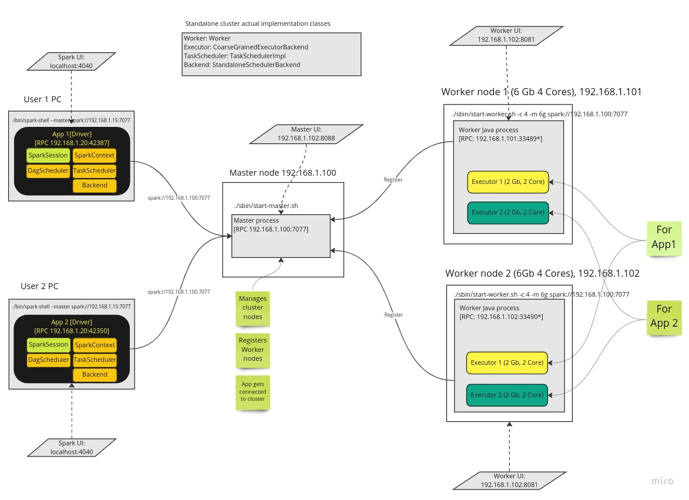

# Apache Spark Internals: Architecture and lifecycle

Below picture depicts in detail main components of the Spark and also assumes standalone cluster mode. 
It uses as an example of two user applications with two driver nodes and executors.

Let's walk through each of the components 

## Components

Broadly speaking Spark got following main components. 
 - Master
 - Worker
 - Driver
 - Executor

#### Master
This a Java process that is running on a separate machine (often) and responsible for managing clusters' worker nodes. 

#### Worker
This also a Java process that is also running on a separate machine and this is responsible to launch Executors.
It communicates with Master and registers itself as a "worker" node and reports available resources for later use.
Normally we have 2+ nodes and together with Master we create a "cluster" and so we can parallelize oor data processing.

#### Executor 
This is another Java process and is created by Worker process. It is running on Worker node and is
actual process that is executing the "tasks". Executors are created as per users request.
We may have number of executors on a worker node and it all depends on how many resources we have got that node.
It's possible to have number of executors on a node that each is doing work for a different driver i.e. user application. 

#### Driver
Client application that defines Spark application logic and also contains other key elements of the Spark like:
_SparkContext, DagScheduler, TaskScheduler, SchedulerBackend etc._
Driver not only defines the application logic but also responsible parsing, optimising and orchestrating it across
cluster.

### Lifecycle of a Spark deployment
Bootstrap starts with Master. Normally we have a dedicated node where we install spark binaries
and start master process on it. Once started in binds to an IP it's on and waits for further instructions. It also starts web UI
where we can see how many workers are connected.

Then we star one or more worker nodes and each has worker process. We specify which master to connect to 
during start up and it gets connected to it and registers itself. We can then check Workers' web UI to see if it managed to connect
or how many executors are running/available/dead on this node. 

At this point cluster is ready for service. We then start our Driver application (App, spark-submit, spark-shell, pyspark etc.)
and specify our Master's address to connect in our SparkSession. Spark then connects to Master and request to allocate executors 
for the application (it can be specified by user or otherwise Spark will use all available resources on that node).
Driver has also got its own web ui which has got a lot of important information to monitor the execution and investigate
the performance issues. 

Then we define our application logic as RDDs or DataFrames. 
As you know RDDs and DataFrames are lazy and so only an "action" (count(), sum, first(), save() etc.) triggers actual executions. 
When we execute an action Spark parses the instruction and splits it to Stages. Stages then further split into Tasks based 
on partition count. 

Once Stages and partitions are known they can be executed in specified order i.e. Stage0, Stage1 etc. 
Spark's DagScheduler with TaskScheduler start communicating with allocated executors **directly** and 
sends/asks executors to accept some tasks. Executors accept tasks and start 
working on them and produces some outputs to be sent to the other nodes or driver. 
The final outputs gets then sent back to Driver node as results to users action(in case it's collect). 

