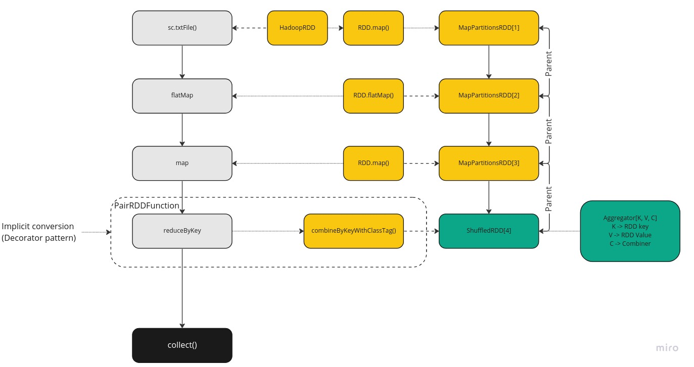
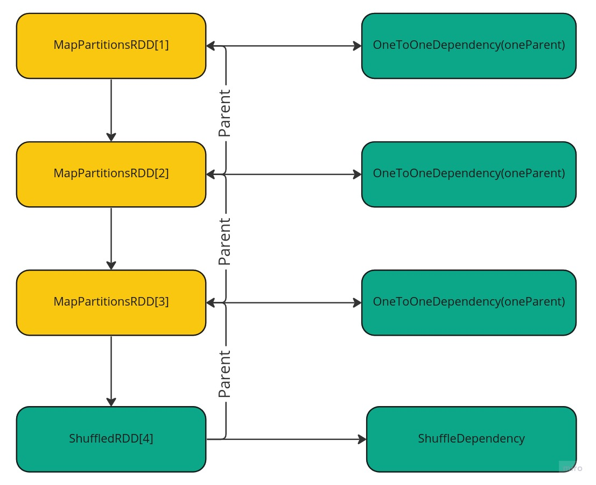
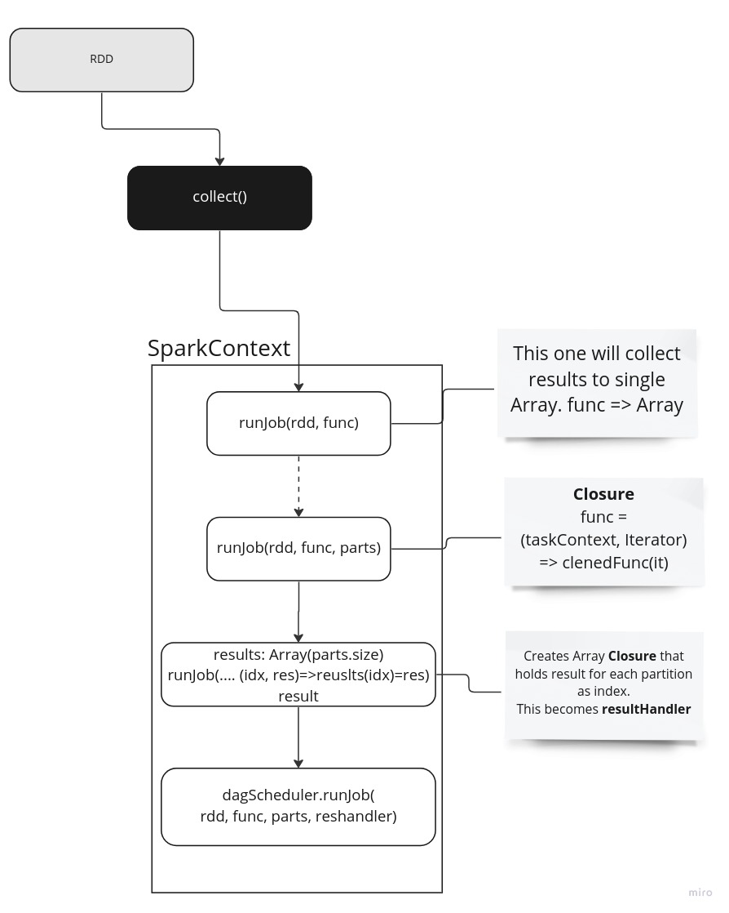

# Apache Spark internals: RDD and Stage creation with Shuffle behind the scenes 

In these "Spark internals" series I am describing how Spark manages our instructions 
and converts them to actionable tasks that is distributed to a cluster and results are collected 
back.

The example I am going to use is below classic word count code that shows essential parts of the Spark 
i.e. map and shuffle. It uses RDD API and that's easier to comprehend and showcase Spark's distributed framework.  

## Example code
Below code is executed in the Scala REPL with all Spark dependencies included (you can check my other 
articles for how to create an environment)

This code reads a file splits words and the counts them:

```scala
import org.apache.spark.{SparkConf, SparkContext}

import java.nio.file.{Path, Paths}

val logFile:Path = Paths.get(System.getProperty("user.home") + "/dev/sample_data/games.csv")

val conf = new SparkConf().setMaster("local[*]").setAppName("My app")
val sc = new SparkContext(conf)

val txtRDD = sc.textFile(logFile.toString, minPartitions = 2)

val flatmap = txtRDD.flatMap(_.split(" "))
val mapped = flatmap.map(w=>(w, 1))
val reduced = mapped.reduceByKey(_+_)

reduced.collect()
```

## RDD creation step by step
There is nothing special first three lines of the code as it's classic Scala/Java code. Then we create 
Spark configuration and set our cluster to local mode via **setMaster** and set app name.

Then we create SparkContext with this configuration.  

Below is explanation what happens for each line where we get RDD as a result for our function invocations:

- **txtRDD**: At this phase SparkContext creates a HadoopRDD instance and then it's wrapped to MapPartitionsRDD instance. 
So, we get something like MapPartitions(HadoopRDD). HadoopRDD is responsible for actually connecting to source file (HDFS, S3, ADLS etc.)
and reading data when it will be called from executors. The partition count for now just registered and 
actual partitions will be computed when necessary (will be explained in later series).
- **flatmap**: This one uses RDD class' flatMap() function that captures the lambda we supply i.e. _.split(" ").
This function is saved in the newly created MapPartitions instance that also has link as a parent to previous MapPartitions
RDD.
- **mapped**: This is very similar to **flatmap** step and creates MapPartitionsRDD and captures the given lambda function.
- **reduced**: At this phase our previous RDD is enriched with additional RDD functions using implicit **PairRDDFunction**
to get this **reduceByKey** method that is using generic **combineByKeyWithClassTag** method to create ShuffleRDD
instance with an aggregator. An aggregator is container that holds functions for data reduction for the given RDD
with functions like "given the values then combine" and "how to create a starting combiner".

See below my illustration of these steps and relationships:  



In above picture, it is important to note that the first three steps created MapPartitionsRDD instance and the last one ShuffledRDD. 
These two groups are deliberate and creates distinction between these two types of steps within Spark framework. 
They define boundary where steps need to be split to create two Stages in the DAG 
and usually referred as "Narrow" and "Wide" transformations. 
- **Narrow**: means that those MapPartitionsRDD can be chained together to do required steps
and can be done independently on each partition on a cluster node
- **Wide**: means for this **reduce** step the data on a node is not sufficient and must be sent to other node to be combined 
to get final result to apply desired lambda function. Hence, ShuffleRDD brakes the chain and forces to move data. 

Each of these stages will receive one part of the RDD i.e. a data partition to work on. Stage 1 will get partitions 
from shuffle phase which is done using in combination with ShuffleDependency class and ShuffleMapStage.

### Dependency

RDD also defines dependencies between each other and type for them. So, for narrow transformations
dependency defined as OneToOneDependency and for wide (shuffle) it is ShuffleDependency. This 
information then dictates where split between transformation happen to become separate stages.



### Stages

Furthermore, actual implementation of these two stages are a bit different though:
- **Stage 0**: This is implemented/represented internally in DAG as **ShuffleMapStage**. Which means that partitions in this stage must be computed based on functions
defined on MapPartitionsRDD and then made ready for shuffle
- **Stage 1**: This is implemented/represented internally in DAG as **ResultStage**. And means that data this is a final stage 
and data can be collected to combined and produce the result and can be returned to user.

Below picture depicts these two stages. Also, image on the right shows the same but taken from Spark UI. 


### Shuffle
Below picture depicts actual execution flow. Each stage gets 2 task (dependent on partition count specified).
At Stage 0 tasks are sent to executors to run in parallel and each task will work on one part of the file i.e.
Part1 or Part2. Well, in our example there is only one file and that gets just split into two parts (from middle).
For Hadoop an alike storages we have a separate blocks for each file and hence tasks will work on those.
Inside a task, a part of data is going through series of transformations. In our case the lines are split to words
then a tuple is created then we count the words with reduceByKey. Once that done using HashPartitioner we split 
outputs into 2 parts, one per part of partition. Each key distributed to partitions based on modulo 
of a keys' hash code divided to its partition count
```
partId = key.hashCode % partCount
```
Finally, data is written to local disk as 
blocks for each partition separately. And this information is communicated to a Drivers MapOutputTracker service 
to be aware of the results. Once all tasks are completed in the given Stage then DagScheduler will schedule 
next one (Stage 1).

At Stage1 again two tasks are launched, one per partition. Here we want to collect all blocks for Partition 1 or Partition 2.
So, we try to load data from either local store or fetch from remote location using BlockStoreShuffleReader class. It
first checks if a block is available locally and if not fetches from relevant Executor. In our case 
one block is in local store and one not so that is fetched. This fetch is done by asking Driver to send location 
for this block for given unique shuffle id.

Once all blocks are fetched for given partition then it can be reduced (combined) again.
So this gives us result of word counts for each word as all occurrences of this word is now available in this task.
The results are sent back to Driver.

The same happens for the other Task 3 on the Executor 2.

Once Task 2 and Task 3 completes then Stage 1 can be marked as Done and whoe Job can be marked complete inside DagScheduler.

And at this phase results from both partitions are gathered into an Array with concatenation and returned to the user!


## Pause and digest
It's vital to stop here and think about what has been said above as often we hear that we need to avoid or 
reduce shuffle steps etc. So, one thing is apparent here is that we need to maximise "narrow" transformations 
as much as possible and "shift to the left" i.e. to the source as much as possible then we can do most processing 
on the source or on given partition first before we can send it to shuffle stage. 
For example check below pseudocode code with two similar tasks that gets to the same result with different performance 
characteristics:
```shell
rdd.reduceByKey(...).filter(...)
rdd.filter(...).reduceByKey(...)
```
First example is inefficient as forces all data to be sent across network to other nodes before it filters not needed
data. And this incurs cost as we ship more data we actually need for our result.
The second example more efficient as it filter unnecessary values first and reduces network traffic and processing power
needed and achieves better performance.

# Collect phase

When we call **collect** method, at this point we ask SparkContext to start handling from now on. 
We call series of **runJob** job methods on it and each of which defines various phases of partition transformation.
Following image depicts these steps and it's explained below:
- First runJob is handling final product and says how an iterable must be handled and in this case simply converted 
to relevant type. Also, it gathers result (with will be Array of Arrays) to a final flattened Array to return to user.
- This time we create a closure with previous function and a new function that is going to handle a result from a task
which contains one partition. 
- The thirst steps creates another closure but this time we define an Array that holds results for each partition
and hence got partition size and will be included as closure as said. So, we will run previous func for each partition
and result will be stored in this array. This function becomes a "resultHandler".
- At this point we are ready to pass our rdd, partitions, func and resultHandler to DAG scheduler for further processing




# Summary
I will go further in the next series to show how these are converted into tasks and 
distributed to cluster.
