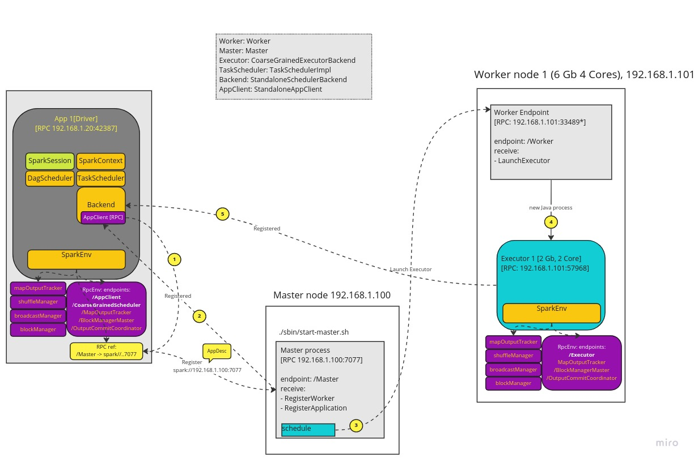

# Apache Spark Internals: Executor launch orchestration

Note: this is WIP article (will do by end of 2022 [in two weeks time])

Below picture depicts in detail how a driver start up process go about launching executor 
requested by user. 

Below is an example of command line that we normally use to start a Driver app.
```commandline
./bin/spark-shell --executor-cores 2 --executor-memory 1G --master spark://192.168.1.100:7077 

Spark context Web UI available at http://192.168.1.20:4040
Spark context available as 'sc' (master = spark://192.168.1.100:7077, app id = app-20221217200505-0004).
Spark session available as 'spark'.
...
Welcome to
      ____              __
     / __/__  ___ _____/ /__
    _\ \/ _ \/ _ `/ __/  '_/
   /___/ .__/\_,_/_/ /_/\_\   version 3.4.0-SNAPSHOT
      /_/
         
                       
```
[TO-DO] Add details steb by step


