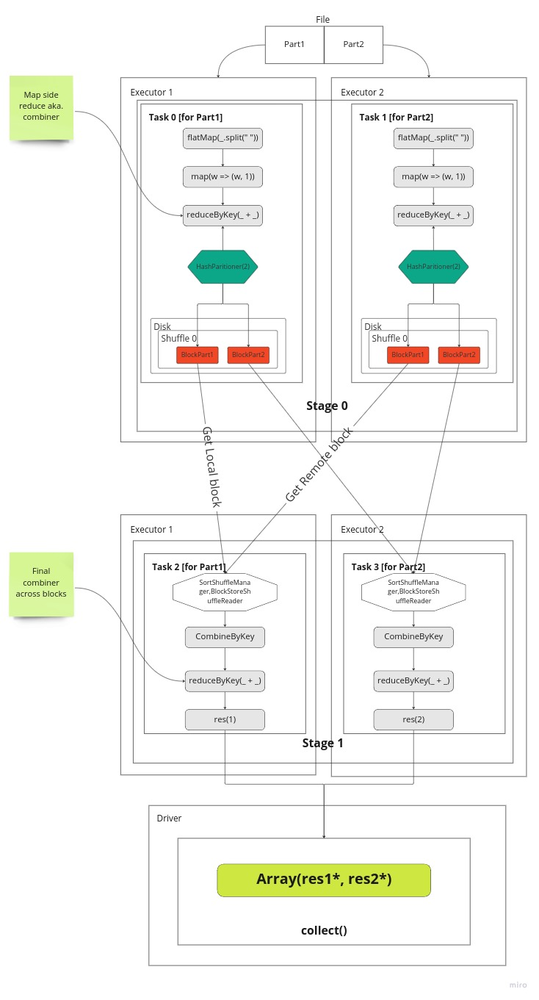

# Apache Spark internals: RDD and Stage creation with Shuffle behind the scenes 

_Note: this is follow up from previous article [Apache Spark internals: RDD creation behind the scenes](spark/spark_internals_rdd.md)_

In these "Spark internals" series I am describing how Spark manages our instructions 
and converts them to actionable tasks that is distributed to a cluster and results are collected 
back.

The example I am going to use is below classic word count code that shows essential parts of the Spark 
i.e. map and shuffle. It uses RDD API and that's easier to comprehend and showcase Spark's distributed framework.  

## Example code
Below code is executed in the Scala REPL with all Spark dependencies included (you can check my other 
articles for how to create an environment)

This code reads a file splits words and the counts them:

```scala
import org.apache.spark.{SparkConf, SparkContext}

import java.nio.file.{Path, Paths}

val logFile:Path = Paths.get(System.getProperty("user.home") + "/dev/sample_data/games.csv")

val conf = new SparkConf().setMaster("local[*]").setAppName("My app")
val sc = new SparkContext(conf)

val txtRDD = sc.textFile(logFile.toString, minPartitions = 2)

val flatmap = txtRDD.flatMap(_.split(" "))
val mapped = flatmap.map(w=>(w, 1))
val reduced = mapped.reduceByKey(_+_)

reduced.collect()
```

### Shuffle process
Below picture depicts actual execution flow. Each stage gets 2 task (dependent on partition count specified).
At Stage 0 tasks are sent to executors to run in parallel and each task will work on one part of the file i.e.
Part1 or Part2. Well, in our example there is only one file and that gets just split into two parts (from middle).
For Hadoop an alike storages we have a separate blocks for each file and hence tasks will work on those.
Inside a task, a part of data is going through series of transformations. In our case the lines are split to words
then a tuple is created then we count the words with reduceByKey. Once that done using HashPartitioner we split 
outputs into 2 parts, one per part of partition. Each key distributed to partitions based on modulo 
of a keys' hash code divided to its partition count
```
partId = key.hashCode % partCount
```
Finally, data is written to local disk as 
blocks for each partition separately. And this information is communicated to a Drivers MapOutputTracker service 
to be aware of the results. Once all tasks are completed in the given Stage then DagScheduler will schedule 
next one (Stage 1).

At Stage1 again two tasks are launched, one per partition. Here we want to collect all blocks for Partition 1 or Partition 2.
So, we try to load data from either local store or fetch from remote location using BlockStoreShuffleReader class. It
first checks if a block is available locally and if not fetches from relevant Executor. In our case 
one block is in local store and one not so that is fetched. This fetch is done by asking Driver to send location 
for this block for given unique shuffle id.

Once all blocks are fetched for given partition then it can be reduced (combined) again.
So this gives us result of word counts for each word as all occurrences of this word is now available in this task.
The results are sent back to Driver.

The same happens for the other Task 3 on the Executor 2.

Once Task 2 and Task 3 completes then Stage 1 can be marked as Done and whoe Job can be marked complete inside DagScheduler.

And at this phase results from both partitions are gathered into an Array with concatenation and returned to the user!



### Shuffle config
The main shuffle configuration in Spark is `spark.sql.shuffle.partitions` which is by default 200. This
config dictates how many partitions Spark must generate during shuffle. Most of the time we need to change this value
and adjust accordingly to our needs. For example if we have large data set and want to maximize our parallelism 
we can set this number to maximum available cores so shuffle produce this number of partitions for later steps to 
advantage of or if we have a small dataset and it's already partitioned let say by
4 partitions we may not want to increase that and keep as 4 as well. Then we need to set this config accordingly to achieve
this. 

### Conclusion
Hopefully, picture already explains what happens when shuffle gets invoked and it's true for RDD and
DataFrame API. Based on this we can make informed decisions how we can manage our data to reduce shuffle 
or make it as efficient as possible for our pipeline. 