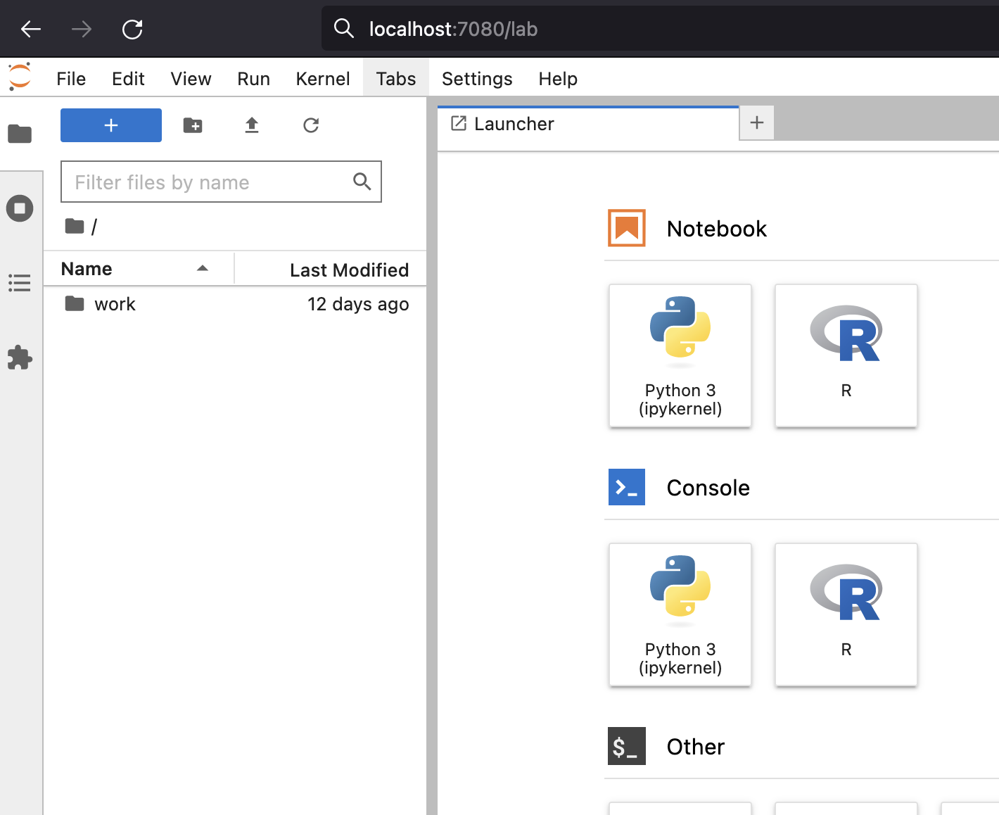
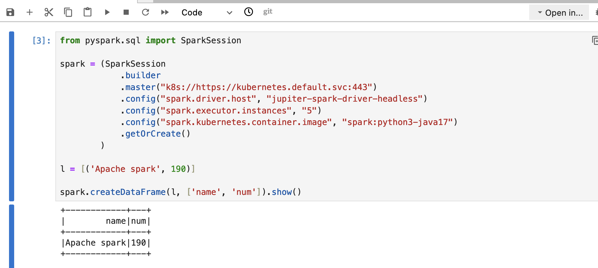

# Running Apache Spark (Client mode) and Jupiter Notebooks on Kubernetes


In this article I will show how to deploy Apache Spark and 
Jupiter Notebook to Kubernetes and interact with Spark using a Notebook. 

Here Spark will be running in "Client" mode within Kubernetes. 
This means that a Driver will be running on a client side (and in our case within
Jupiter Lab's pod) and Workers/Executors will be dynamically allocated as per need.

## Requirements
You will need running Kubernetes cluster or just use local cluster. 
Also, I am using a remote Linux host for docker/minikube environment and some of below commands (make) need Linux.
And using Mac Book for client environment to connect to Jupiter Notebook via browser.

- docker
- minikube (optional)

## Build
Jupiter Lab images provide Spark pre-packaged but it is not possible to use with latest spark images
due to Python incompatibility (Jupiter Lab image uses Python 3.11 and Spark Python 3.10).

So, in order to make them aligned I am going to recompile JupiterLab image with 3.10. 
This feature is already provided in Jupiter Lab's Dokerfile source codes and easy to do so. 

First, lets clone Official Jupiter Lab images repo:
```commandline
git clone https://github.com/jupyter/docker-stacks.git
cd docker-stacks
```

Optional, run below if you use minikube
```commandline
eval $(minikube -p minikube docker-env)
```

Then recompile images
```commandline
export DOCKER_BUILD_ARGS="--build-arg PYTHON_VERSION=3.10"
export OWNER=library
export REGISTRY=docker.io
make build-all
```

Verify that all images are created (some of them are not necessary for this exercise)
```commandline
docker images

REPOSITORY                                 TAG                             IMAGE ID       CREATED          SIZE
all-spark-notebook                         latest                          e29d84984521   38 minutes ago   7.2GB
pyspark-notebook                           latest                          31df30791633   39 minutes ago   6.36GB
datascience-notebook                       latest                          461e586947b6   41 minutes ago   7.49GB
pytorch-notebook                           latest                          cb79cf96bbad   45 minutes ago   6.35GB
tensorflow-notebook                        latest                          7ca4e492ea43   45 minutes ago   7.18GB
scipy-notebook                             latest                          e5aac6447efe   47 minutes ago   5.65GB
julia-notebook                             latest                          a962f004f55f   24 hours ago     2.37GB
r-notebook                                 latest                          0dc233997ffe   24 hours ago     2.78GB
quay.io/jupyter/docker-stacks-foundation   latest                          cd9ab9cb563c   24 hours ago     397MB
minimal-notebook                           latest                          5458db4ccc41   24 hours ago     1.52GB
base-notebook                              latest                          df66b7630f44   24 hours ago     1.03GB
```

## Deploy Jupiter Lab 
Jupiter Lab image is ready to be run but I am going to package that to a Kubernetes Deployment so I can add
additional configurations and install it easily.

Below is complete YAML file. It defines Deployment for Jupiter Lab and two Services.
One for web interface, so we can connect to it and one (headless) for internal pod to pod communication.

And I set newly created **image** as base for Jupiter Lab that will have Python 3.10.
Also, applying necessary permissions to a serviceaccount called **spark** so it can read and launch new pods.

_jupiter_spark.yaml_
```yaml
apiVersion: apps/v1
kind: Deployment
metadata:
   name: jupiter-spark
   namespace: default
spec:
   replicas: 1
   selector:
      matchLabels:
         app: spark
   template:
      metadata:
         labels:
            app: spark
      spec:
         containers:
            - name: jupiter-spark-container
              image: pyspark-notebook
              imagePullPolicy: IfNotPresent
---
apiVersion: v1
kind: Service
metadata:
   name: jupiter-spark-svc
   namespace: default
spec:
   type: NodePort
   selector:
      app: spark
   ports:
      - port: 8888
        targetPort: 8888
        nodePort: 30001
---
apiVersion: v1
kind: Service
metadata:
  name: jupiter-spark-driver-headless
spec:
  clusterIP: None
  selector:
    app: spark
---
apiVersion: v1
kind: ServiceAccount
metadata:
  name: spark 
---
apiVersion: v1
kind: Role
apiVersion: rbac.authorization.k8s.io/v1
metadata:
  namespace: default
  name: pod-reader
rules:
- apiGroups: [""] # "" indicates the core API group
  resources: ["pods"]
  verbs: ["get", "watch", "list"]
---
apiVersion: rbac.authorization.k8s.io/v1
kind: ClusterRoleBinding
metadata:
  name: pod-reader-binding
subjects:
- kind: ServiceAccount
  name: spark
  namespace: default
roleRef:
  kind: ClusterRole
  name: pod-reader
  apiGroup: rbac.authorization.k8s.io
---
apiVersion: rbac.authorization.k8s.io/v1
kind: ClusterRoleBinding
metadata:
  name: cluster-edit-binding
subjects:
- kind: ServiceAccount
  name: spark
  namespace: default
roleRef:
  kind: ClusterRole
  name: edit
  apiGroup: rbac.authorization.k8s.io
```

Apply the yaml:
```commandline
kubetctl apply -f jupiter_spark.yaml

deployment.apps/jupiter-spark created
service/jupiter-spark-svc created
service/jupiter-spark-driver-headless created
role.rbac.authorization.k8s.io/pod-reader created
clusterrolebinding.rbac.authorization.k8s.io/pod-reader-binding created
clusterrolebinding.rbac.authorization.k8s.io/cluster-edit-binding created
```

check the installation
```commandline
kubectl get pods

NAME                              READY   STATUS    RESTARTS     AGE
jupiter-spark-6c8756c5f9-81ei4    1/1     Running   1 (1h ago)   5m
```

## Connect to Spark from Jupiter Notebook

All set for this step and we just need to connect to Jupiter server running on a pod.
Since it's running on a pod then we need to expose the server to outside world in order to connect to it.

Let's run below command for it that will bind port and route outside traffic to the pod:
```commandline
kubectl port-forward service/jupiter-spark-svc 7080:8888

# If you are running on a specific host and IP
# kubectl port-forward service/jupiter-spark-svc 7080:8888 --address 192.168.1.180
```

Now we can open Jupiter Hub on a browser:
```python
http://localhost:7080/lab
```



# Connect and run some Spark code

Lets connect to cluster from Jupiter and run some Spark code that uses Kubernetes as a Master.
Here important part `.master("k8s://https://kubernetes.default.svc:443")` where we set Spark
Master to be Kubernetes so it can provision pods for executors.

Below is sample code:
```python
from pyspark.sql import SparkSession

spark = (SparkSession
            .builder
            .master("k8s://https://kubernetes.default.svc:443")
            .config("spark.driver.host", "jupiter-spark-driver-headless")
            .config("spark.executor.instances", "5")
            .config("spark.kubernetes.container.image", "spark:python3-java17")
            .getOrCreate()
        )

l = [('Apache spark', 190)]

spark.createDataFrame(l, ['name', 'num']).show()
```

you should get output like below:



# Stopping Session

When you finish your analysis, you will need to stop the session to remove clear up running pods.
Lets check how it looks like before stopping:
```commandline
kubectl get pods

NAME                                    READY   STATUS    RESTARTS      AGE
jupiter-spark-7d45d778ff-kn28c          1/1     Running   2 (47h ago)   2d9h
pyspark-shell-0138138c1f44e7c3-exec-1   1/1     Running   0             27s
pyspark-shell-0138138c1f44e7c3-exec-2   1/1     Running   0             26s
pyspark-shell-0138138c1f44e7c3-exec-3   1/1     Running   0             26s
pyspark-shell-0138138c1f44e7c3-exec-4   1/1     Running   0             26s
pyspark-shell-0138138c1f44e7c3-exec-5   1/1     Running   0             26s
```

Now when you run `spark.stop()` in your Jupiter Lab it should stop all these executors.
Checking:
```commandline
kubectl get pods

NAME                                    READY   STATUS    RESTARTS      AGE
jupiter-spark-7d45d778ff-kn28c          1/1     Running   2 (47h ago)   2d9h
```

# Scaling Spark cluster

Scaling cluster with Kubernetes is very easy.

Just set desired executor count in the config via "spark.executor.instances"
property during session creation time:
```python
 from pyspark.sql import SparkSession

spark = (SparkSession
            .builder
            .master("k8s://https://kubernetes.default.svc:443")
            .config("spark.driver.host", "jupiter-spark-driver-headless")
            .config("spark.executor.instances", "10") # <<<< Here
            .config("spark.kubernetes.container.image", "spark:python3-java17")
            .getOrCreate()
        )

l = [('Apache spark', 190)]

spark.createDataFrame(l, ['name', 'num']).show()
```

Check
```commandline
kubectl get pods
NAME                                     READY   STATUS    RESTARTS      AGE
jupiter-spark-7d45d778ff-kn28c           1/1     Running   2 (47h ago)   2d9h
pyspark-shell-902b948c1f4ad29c-exec-1    1/1     Running   0             58s
pyspark-shell-902b948c1f4ad29c-exec-10   1/1     Running   0             57s
pyspark-shell-902b948c1f4ad29c-exec-2    1/1     Running   0             58s
pyspark-shell-902b948c1f4ad29c-exec-3    1/1     Running   0             58s
pyspark-shell-902b948c1f4ad29c-exec-4    1/1     Running   0             58s
pyspark-shell-902b948c1f4ad29c-exec-5    1/1     Running   0             58s
pyspark-shell-902b948c1f4ad29c-exec-6    1/1     Running   0             57s
pyspark-shell-902b948c1f4ad29c-exec-7    1/1     Running   0             57s
pyspark-shell-902b948c1f4ad29c-exec-8    1/1     Running   0             57s
pyspark-shell-902b948c1f4ad29c-exec-9    1/1     Running   0             57s
```
# Conclusion

Intention of this article was to show how it's easy to get up and started 
with Spark and start running analytics on Spark using Kubernetes.

#### References

https://spark.apache.org/docs/latest/running-on-kubernetes.html

https://jupyter-docker-stacks.readthedocs.io/en/latest/using/selecting.html#jupyter-all-spark-notebook

https://github.com/jupyter/docker-stacks