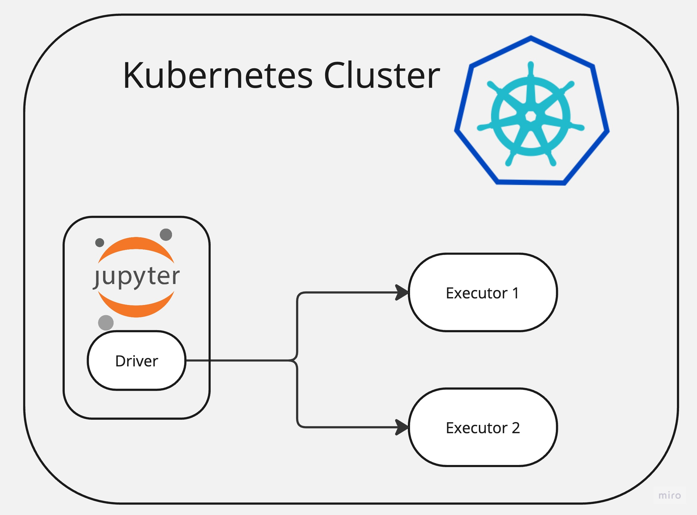
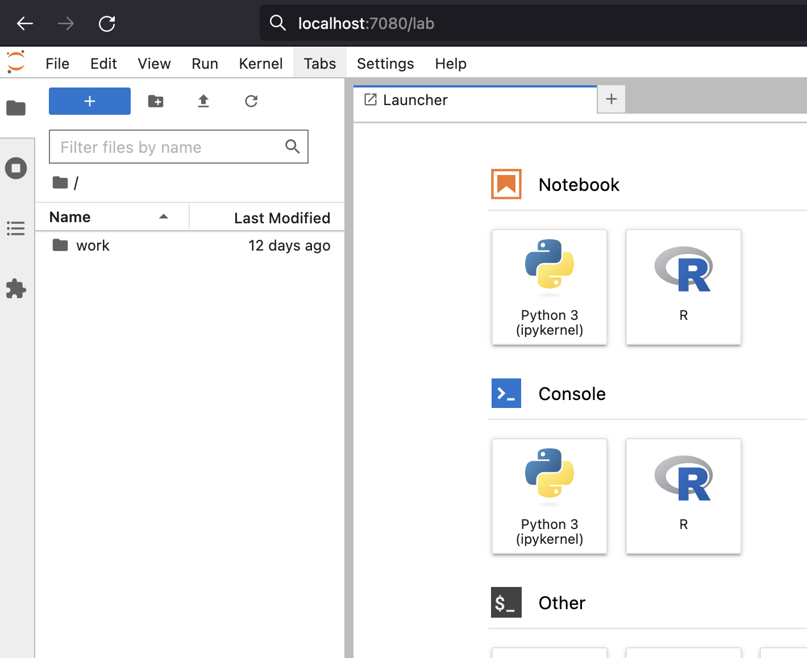
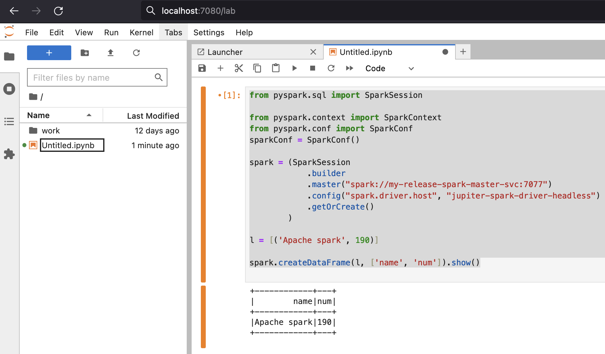

# Running Apache Spark and Jupiter Notebooks on Kubernetes with Helm Charts




There are various ways to deploy and run Apache Spark but undoubtedly one of the easiest one is to use 
Kubernetes.

In this article I will show how it's easy to deploy Apache Spark and 
Jupiter Notebook to Kubernetes environment and start doing data analysis straightaway. 

## Requirements
You will need running Kubernetes cluster or just use local cluster.

- minikube
- helm

## Setup Apache Spark
This is by all means the easiest way I have ever installed Spark. 

Once you have your Helm tool installed locally run below command to download and install 
Spark using Helm Chart from Bitnami.

```commandline
helm install my-release oci://registry-1.docker.io/bitnamicharts/spark
```
This command will deploy a Spark cluster with 3 nodes, Master and 2 Worker nodes.

Check deployment
```commandline
kubectl get pods
NAME                              READY   STATUS    RESTARTS      AGE
my-release-spark-master-0         1/1     Running   0 (1m ago)    1m
my-release-spark-worker-0         1/1     Running   0 (1m ago)    1m
my-release-spark-worker-1         1/1     Running   0 (1m ago)    1m
```

## Deploy Jupiter Hub 
For this task I am using official [Jupiter Hub images](https://github.com/jupyter/docker-stacks)
but I will pack them to a Kubernetes Deployment so I can install it easily.

Below is complete YAML file. It defines Deployment for Jupiter Hub and two Services.
One for web interface, so we can connect to it and one (headless) for internal pod to pod communication.

_jupiter.yaml_
```yaml
apiVersion: apps/v1
kind: Deployment
metadata:
   name: jupiter-spark
   namespace: default
spec:
   replicas: 1
   selector:
      matchLabels:
         app: spark
   template:
      metadata:
         labels:
            app: spark
      spec:
         containers:
            - name: jupiter-spark-container
              image: quay.io/jupyter/all-spark-notebook
              imagePullPolicy: IfNotPresent
---
apiVersion: v1
kind: Service
metadata:
   name: jupiter-spark-svc
   namespace: default
spec:
   type: NodePort
   selector:
      app: spark
   ports:
      - port: 8888
        targetPort: 8888
        nodePort: 30001
---
apiVersion: v1
kind: Service
metadata:
  name: jupiter-spark-driver-headless
spec:
  clusterIP: None
  selector:
    app: spark
```

Apply the yaml:
```commandline
kubetctl apply -f jupiter.yaml
```

check the installation
```commandline
kubectl get pods

NAME                              READY   STATUS    RESTARTS     AGE
jupiter-spark-6c8756c5f9-81ei4    1/1     Running   1 (1h ago)   5m
my-release-spark-master-0         1/1     Running   1 (1m ago)   5min
my-release-spark-worker-0         1/1     Running   1 (1m ago)   5min
my-release-spark-worker-1         1/1     Running   1 (1m ago)   5min
```

## Connect to Spark from Jupiter Notebook

All set for this step and we just need to connect to Jupiter server running on a pod.
Since it's running on a pod then we need to expose it, so we can connect.

Let's run below command for it:
```commandline
kubectl port-forward service/jupiter-spark-svc 7080:8888

# If you are running on a specific host and IP
# kubectl port-forward service/jupiter-spark-svc 7080:8888 --address 192.168.1.180
```

Now we can open Jupiter Hub on a browser:
```python
http://localhost:7080/lab
```



# Connect and run some Spark code

Lets connect to cluster from Jupiter and run some Spark code.

Below is sample code:
```python
from pyspark.sql import SparkSession

from pyspark.context import SparkContext
from pyspark.conf import SparkConf
sparkConf = SparkConf()

spark = (SparkSession
            .builder
            .master("spark://my-release-spark-master-svc:7077")
            .config("spark.driver.host", "jupiter-spark-driver-headless")
            .getOrCreate()
        )

l = [('Apache spark', 190)]

spark.createDataFrame(l, ['name', 'num']).show()
```

you should get output like below:



# Scaling Spark cluster

Scaling cluster with Kubernetes and Helm is very easy.

Just set desired replica count and upgrade the release:
```commandline
helm upgrade --set worker.replicaCount=3 my-release oci://registry-1.docker.io/bitnamicharts/spark 
```

Check
```commandline
kubectl get pods
NAME                              READY   STATUS    RESTARTS     AGE
jupiter-spark-6c8756c5f9-81ei4    1/1     Running   1 (10h ago)  29h
my-release-spark-master-0         1/1     Running   1 (1m ago)   1h
my-release-spark-worker-0         1/1     Running   1 (1m ago)   1h
my-release-spark-worker-1         1/1     Running   1 (1m ago)   1h
my-release-spark-worker-2         1/1     Running   1 (1m ago)   1h
```
# Conclusion

Intention of this article was to show how it's easy to get started 
with Spark and start running analytics on Spark cluster.

#### References

https://bitnami.com/stack/spark/helm

https://github.com/bitnami/charts/tree/main/bitnami/spark/#installing-the-chart

https://jupyter-docker-stacks.readthedocs.io/en/latest/using/selecting.html

https://hub.docker.com/r/bitnami/spark

https://github.com/bitnami/containers/blob/main/bitnami/spark/3.5/debian-11/Dockerfile