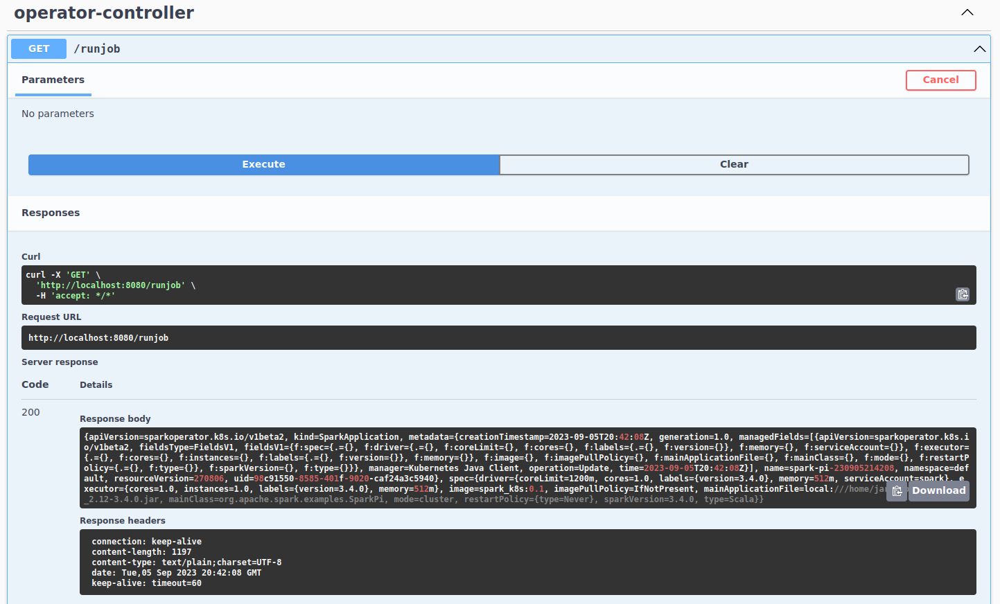

# Running Spark on Kubernetes using spark-on-k8s-operator, CRDs and scheduling it from microservice

This article demonstrates how to run Apache Spark on Kubernetes using Custom Resource Definitions (CRDs). Here, I will show what needs to be done 
to test it on your local machine and will create a demo Spring Boot based web app that shows how it's easy to 
integrate and schedule Spark apps from your microservices.  

Link to repo: https://github.com/khalidmammadov/SparkOperatorBoot.git

## Requirements
- JDK
- Docker
- minikube
- helm
- Demo repo

## Environment setup
Clone Demo repo that got all sample code and Dockerfile:
```commandline
cd home
git clone https://github.com/khalidmammadov/SparkOperatorBoot.git
```

Start minikube so we can launch pods. See References section for links on how to install these if you dont have.
```commandline
minikube start --cpus 4 --memory 8192
```
Point docker CLI to the docker inside container
```commandline
eval $(minikube -p minikube docker-env)
```
Create a new k8s namespace: 
```commandline
kubectl create ns spark-demo
```

Create RBAC roles:
```commandline
kubectl create serviceaccount spark
kubectl create clusterrolebinding spark-role --clusterrole=edit --serviceaccount=default:spark --namespace=default
```

## Install spark-on-k8s-operator. 

This will deploy operator pod 
```commandline
helm repo add spark-operator https://googlecloudplatform.github.io/spark-on-k8s-operator
helm install my-release spark-operator/spark-operator
helm status my-release
```

## Optional: Build spark to take an example jar file
Here we build spark from source code. The only thing we need from that build is an example jar file that will be 
used as sample Spark app. But you can use your app if you have one. 

```commandline
clone https://github.com/apache/spark.git
cd spark
./build/mvn -Pkubernetes -DskipTests clean package
```

Once build has finished find below file in:
```
cd spark/examples/target
ls spark-examples_2.12-3.5.0-SNAPSHOT.jar
```

## Prepare sample Spark application 
Copy your jar from previous step or your own one next to Dockerfile in the repo dir:
```commandline
cp spark-examples_2.12-3.5.0-SNAPSHOT.jar /home/SparkOperatorBoot/src/main/resources
```

## Build docker image
Navigate to Dockerfile folder and run below. It will build a new image from Apache Spark's base image 
and copy test app into it.

```yaml
FROM apache/spark:3.4.0

RUN mkdir -p /home/jars

ADD spark-examples_2.12-3.4.0.jar /home/jars

```

```commandline
cd /home/SparkOperatorBoot/src/main/resources
docker build -f Dockerfile -t spark_k8s:0.1 .
```

# Manual test run
We can test app on k8s to see if setup so far works. Below is an example YAML file that
define a Spark app with cluster details that can be run on kubernetes:
```yaml
apiVersion: "sparkoperator.k8s.io/v1beta2"
kind: SparkApplication
metadata:
  name: mt-test-pi-app
  namespace: default
spec:
  type: Scala
  mode: cluster
  image: "spark_k8s:0.1"
  imagePullPolicy: IfNotPresent
  mainClass: org.apache.spark.examples.SparkPi
  mainApplicationFile: "local:///home/jars/spark-examples_2.12-3.4.0.jar"
  sparkVersion: "3.4.0"
  restartPolicy:
    type: Never
  driver:
    cores: 1
    coreLimit: "1200m"
    memory: "512m"
    labels:
      version: 3.4.0
    serviceAccount: spark
  executor:
    cores: 1
    instances: 1
    memory: "512m"
    labels:
      version: 3.4.0
```

Save that in a file or just navigate as below to the test folder in repo and run it on kubernetes:
```commandline
cd SparkOperatorBoot/src/test/resources
kubectl apply -f test-spark-pi-my.yaml
```
check that it's running:
```commandline
kubectl get pods
NAME                                         READY   STATUS      RESTARTS       AGE
hello-minikube-77b6f68484-9j9hs              1/1     Running     5 (3h9m ago)   113d
mt-test-pi-app-driver                        1/1     Running     0              11s
my-release-spark-operator-57d966fdfc-pj4rp   1/1     Running     3 (3h9m ago)   112d
```
Check Spark logs:
```commandline
kubectl logs mt-test-pi-app-driver
```
```commandline
Files  local:///home/jars/spark-examples_2.12-3.4.0.jar from /home/jars/spark-examples_2.12-3.4.0.jar to /opt/spark/work-dir/./spark-examples_2.12-3.4.0.jar
23/09/03 13:44:35 WARN NativeCodeLoader: Unable to load native-hadoop library for your platform... using builtin-java classes where applicable
23/09/03 13:44:35 INFO SparkContext: Running Spark version 3.4.0
23/09/03 13:44:35 INFO ResourceUtils: ==============================================================
23/09/03 13:44:35 INFO ResourceUtils: No custom resources configured for spark.driver.
23/09/03 13:44:35 INFO ResourceUtils: ==============================================================
23/09/03 13:44:35 INFO SparkContext: Submitted application: Spark Pi
23/09/03 13:44:35 INFO ResourceProfile: Default ResourceProfile created, executor resources: Map(cores -> name: cores, amount: 1, script: , vendor: , memory -> name: memory, amount: 512, script: , vendor: , offHeap -> name: offHeap, amount: 0, script: , vendor: ), task resources: Map(cpus -> name: cpus, amount: 1.0)
23/09/03 13:44:35 INFO ResourceProfile: Limiting resource is cpus at 1 tasks per executor
....................................
....................................
Pi is roughly 3.1391356956784784
23/09/03 13:44:46 INFO SparkContext: SparkContext is stopping with exitCode 0.
23/09/03 13:44:46 INFO SparkUI: Stopped Spark web UI at http://mt-test-pi-app-0703e28a5b49a60c-driver-svc.default.svc:4040
23/09/03 13:44:46 INFO KubernetesClusterSchedulerBackend: Shutting down all executors
23/09/03 13:44:46 INFO KubernetesClusterSchedulerBackend$KubernetesDriverEndpoint: Asking each executor to shut down
23/09/03 13:44:46 WARN ExecutorPodsWatchSnapshotSource: Kubernetes client has been closed.
23/09/03 13:44:46 INFO MapOutputTrackerMasterEndpoint: MapOutputTrackerMasterEndpoint stopped!
23/09/03 13:44:46 INFO MemoryStore: MemoryStore cleared
23/09/03 13:44:46 INFO BlockManager: BlockManager stopped
23/09/03 13:44:46 INFO BlockManagerMaster: BlockManagerMaster stopped
23/09/03 13:44:46 INFO OutputCommitCoordinator$OutputCommitCoordinatorEndpoint: OutputCommitCoordinator stopped!
23/09/03 13:44:46 INFO SparkContext: Successfully stopped SparkContext
23/09/03 13:44:46 INFO ShutdownHookManager: Shutdown hook called
23/09/03 13:44:46 INFO ShutdownHookManager: Deleting directory /tmp/spark-b0caed56-e06a-4e64-83de-a864fa9749b3
23/09/03 13:44:46 INFO ShutdownHookManager: Deleting directory /var/data/spark-95a9b947-e9f4-46e7-b231-b006e3799253/spark-b3220ae0-5271-4394-aa32-09445fa32311
```

## Spring boot app that can run Spark app using CRDs
Now lets run above using a sample Spring Boot app via a Rest API.
For this we will need to communicate with Kubernetes API and since we are using a custom CRDs we need to generate Java models or APIs
that we can use within Spring Boot app.

### Optional: Generate Model APIs for Java
The repo you have cloned already contain generated models but below is the steps to regenerate it incase you need updated version.
Run below command to generate Models API for Java. Make sure you do above steps in set up phase to have minikube and spark-on-k8s-operator installed.
```commandline
mkdir -p /tmp/java && cd /tmp/java
docker run \
  --rm \
  -v /var/run/docker.sock:/var/run/docker.sock \
  -v "$(pwd)":"$(pwd)" \
  -ti \
  --network host \
  ghcr.io/kubernetes-client/java/crd-model-gen:v1.0.6 \
  /generate.sh \
  -u https://raw.githubusercontent.com/GoogleCloudPlatform/spark-on-k8s-operator/master/manifest/crds/sparkoperator.k8s.io_sparkapplications.yaml \
  -u https://raw.githubusercontent.com/GoogleCloudPlatform/spark-on-k8s-operator/master/manifest/crds/sparkoperator.k8s.io_scheduledsparkapplications.yaml \
  -n io.k8s.sparkoperator \
  -p io.k8s.sparkoperator  \
  -o "$(pwd)"
```

This will generate APIs into `/tmp/java/gen/src/main/java/io/k8s/sparkoperator/models` folder.

You can copy that into your Spring Boot app and use it. As mentioned the repo for this article already has that and so you can use one from repo as is.

### Spring Boot Rest API to start Spark App
Below code defines two Rest end points. One for running a Spark job and the other for listing all pods/jobs. It uses 
generated Models API. 

```java
@RestController
public class OperatorController {
    @GetMapping("/")
    public String index() {
        return "Greetings from Spring Boot!";
    }

    @Autowired
    ApiClient apiClient;

    static {
        ModelMapper.addModelMap("sparkoperator.k8s.io",
                "v1beta2", "SparkApplication", "sparkapplications", true, V1beta2SparkApplication.class);
    }

    // This is GET for simplicity
    @RequestMapping(value = "/runjob", method = RequestMethod.GET)
    public String runJob() throws IOException, ApiException, URISyntaxException {
        var yamlTemplate = new String(
                getClass()
                        .getClassLoader()
                        .getResourceAsStream("spark-pi-my.yaml")
                        .readAllBytes(), StandardCharsets.UTF_8
        );
        var suffix = new SimpleDateFormat("yyMMddHHmmss").format(new Date());
        var resolved = yamlTemplate.replace("<APP_NAME>", "spark-pi-"+suffix );
        System.out.println(resolved);
        var sparkApp = (V1beta2SparkApplication) Yaml.load(resolved);

        CustomObjectsApi customObjectsApi = new CustomObjectsApi(apiClient);

        try {
            Object res = customObjectsApi.createNamespacedCustomObject(
                    "sparkoperator.k8s.io",
                    "v1beta2",
                    "default",
                    "sparkapplications",
                    sparkApp,
                    "true",
                    null,
                    null
            );
            return res.toString();
        } catch (ApiException e) {
            return String.format("%s %s %s",
                    e.getMessage(), e.getCode(), e.getResponseBody());
        }

    }
    
    @RequestMapping(value = "/listpods", method = RequestMethod.GET)
    public String listPods() throws IOException, ApiException {
        CoreV1Api api = new CoreV1Api();
        V1PodList list = api.listPodForAllNamespaces(null, null, null, null, null, null, null, null, null, null);
        for (V1Pod item : list.getItems()) {
            System.out.println(item.getMetadata().getName());
        }
        return list.getItems().stream().map(item-> item.getMetadata().getNamespace().toString()+"  "+item.getMetadata().getName()+"\n").toList().toString();
    }

}
```
**runJob** rest endpoint start a new Spark job on Kubernetes with specified executor counts and other configs 
specified on the YAML (spark-pi-my.yaml) file in the **resources** folder. It only replaces a template variable APP_NAME
with a new job name for uniqueness and starts the job.
```yaml
apiVersion: "sparkoperator.k8s.io/v1beta2"
kind: SparkApplication
metadata:
  name: <APP_NAME>
  namespace: default
spec:
  type: Scala
  mode: cluster
  image: "spark_k8s:0.1"
  imagePullPolicy: IfNotPresent
  mainClass: org.apache.spark.examples.SparkPi
  mainApplicationFile: "local:///home/jars/spark-examples_2.12-3.4.0.jar"
  sparkVersion: "3.4.0"
  restartPolicy:
    type: Never
  driver:
    cores: 1
    coreLimit: "1200m"
    memory: "512m"
    labels:
      version: 3.4.0
    serviceAccount: spark
  executor:
    cores: 1
    instances: 1
    memory: "512m"
    labels:
      version: 3.4.0
```

## Running the app
Run this Spring Boot Web app in your IDE or from console.

Then you can use below Rest APIs to run and list pods respectively:
```commandline
http://127.0.0.1:8080/runjob
http://127.0.0.1:8080/listpods
# or using Swagger
http://localhost:8080/swagger-ui/index.html#/operator-controller/runjob
http://localhost:8080/swagger-ui/index.html#/operator-controller/listPods
```

**runjob** will return YAML corresponding created SparkApplication. Something like this:
```yaml
  "apiVersion": "sparkoperator.k8s.io/v1beta2",
  "kind": "SparkApplication",
  "metadata": {
    "creationTimestamp": "2023-09-05T20:26:20Z",
    "generation": 1,
    "managedFields": [
      {
      ................
      ................
      ................ 
      }
    ],
    "name": "spark-pi-230905212619",
    "namespace": "default",
    "resourceVersion": "269928",
    "uid": "6abf1b5f-8cc8-46f7-88e0-3a089cf4554b"
  },
  "spec": {
    "driver": {
      "coreLimit": "1200m",
      "cores": 1,
      "labels": {
        "version": "3.4.0"
      },
      "memory": "512m",
      "serviceAccount": "spark"
    },
    "executor": {
      "cores": 1,
      "instances": 1,
      "labels": {
        "version": "3.4.0"
      },
      "memory": "512m"
    },
    "image": "spark_k8s:0.1",
    "imagePullPolicy": "IfNotPresent",
    "mainApplicationFile": "local:///home/jars/spark-examples_2.12-3.4.0.jar",
    "mainClass": "org.apache.spark.examples.SparkPi",
    "mode": "cluster",
    "restartPolicy": {
      "type": "Never"
    },
    "sparkVersion": "3.4.0",
    "type": "Scala"
  }
}
```



### Checking
You can check the started and completed apps:
```commandline
$ kubectl get pods
NAME                                         READY   STATUS      RESTARTS        AGE
hello-minikube-77b6f68484-9j9hs              1/1     Running     5 (2d10h ago)   116d
my-release-spark-operator-57d966fdfc-pj4rp   1/1     Running     3 (2d10h ago)   114d
spark-pi-230905214007-driver                 0/1     Completed   0               5m3s
spark-pi-230905214208-driver                 0/1     Completed   0               3m1s
```

Let's check logs as well:
```commandline
$ kubectl logs spark-pi-230905214208-driver
Files  local:///home/jars/spark-examples_2.12-3.4.0.jar from /home/jars/spark-examples_2.12-3.4.0.jar to /opt/spark/work-dir/./spark-examples_2.12-3.4.0.jar
23/09/05 20:42:17 WARN NativeCodeLoader: Unable to load native-hadoop library for your platform... using builtin-java classes where applicable
23/09/05 20:42:17 INFO SparkContext: Running Spark version 3.4.0
23/09/05 20:42:17 INFO ResourceUtils: ==============================================================
23/09/05 20:42:17 INFO ResourceUtils: No custom resources configured for spark.driver.
23/09/05 20:42:17 INFO ResourceUtils: ==============================================================
23/09/05 20:42:17 INFO SparkContext: Submitted application: Spark Pi
..................
23/09/05 20:42:18 INFO JettyUtils: Start Jetty 0.0.0.0:4040 for SparkUI
23/09/05 20:42:19 INFO Utils: Successfully started service 'SparkUI' on port 4040.
23/09/05 20:42:19 INFO SparkContext: Added JAR local:/home/jars/spark-examples_2.12-3.4.0.jar at file:/home/jars/spark-examples_2.12-3.4.0.jar with timestamp 1693946537279
23/09/05 20:42:19 WARN SparkContext: The JAR local:///home/jars/spark-examples_2.12-3.4.0.jar at file:/home/jars/spark-examples_2.12-3.4.0.jar has been added already. Overwriting of added jar is not supported in the current version.
..................
23/09/05 20:42:28 INFO SparkContext: Starting job: reduce at SparkPi.scala:38
23/09/05 20:42:28 INFO DAGScheduler: Got job 0 (reduce at SparkPi.scala:38) with 2 output partitions
23/09/05 20:42:28 INFO DAGScheduler: Final stage: ResultStage 0 (reduce at SparkPi.scala:38)
23/09/05 20:42:28 INFO DAGScheduler: Parents of final stage: List()
23/09/05 20:42:28 INFO DAGScheduler: Missing parents: List()
23/09/05 20:42:28 INFO DAGScheduler: Submitting ResultStage 0 (MapPartitionsRDD[1] at map at SparkPi.scala:34), which has no missing parents
23/09/05 20:42:28 INFO MemoryStore: Block broadcast_0 stored as values in memory (estimated size 4.0 KiB, free 117.0 MiB)
..................
23/09/05 20:42:29 INFO TaskSchedulerImpl: Removed TaskSet 0.0, whose tasks have all completed, from pool 
23/09/05 20:42:29 INFO DAGScheduler: ResultStage 0 (reduce at SparkPi.scala:38) finished in 1.293 s
23/09/05 20:42:29 INFO DAGScheduler: Job 0 is finished. Cancelling potential speculative or zombie tasks for this job
23/09/05 20:42:29 INFO TaskSchedulerImpl: Killing all running tasks in stage 0: Stage finished
23/09/05 20:42:29 INFO DAGScheduler: Job 0 finished: reduce at SparkPi.scala:38, took 1.414788 s
Pi is roughly 3.1319756598782993
23/09/05 20:42:29 INFO SparkContext: SparkContext is stopping with exitCode 0.
23/09/05 20:42:29 INFO SparkUI: Stopped Spark web UI at http://spark-pi-230905214208-e6d4db8a6714c9ff-driver-svc.default.svc:4040
23/09/05 20:42:29 INFO KubernetesClusterSchedulerBackend: Shutting down all executors
23/09/05 20:42:29 INFO KubernetesClusterSchedulerBackend$KubernetesDriverEndpoint: Asking each executor to shut down
23/09/05 20:42:29 WARN ExecutorPodsWatchSnapshotSource: Kubernetes client has been closed.
23/09/05 20:42:29 INFO MapOutputTrackerMasterEndpoint: MapOutputTrackerMasterEndpoint stopped!
23/09/05 20:42:29 INFO MemoryStore: MemoryStore cleared
23/09/05 20:42:29 INFO BlockManager: BlockManager stopped
23/09/05 20:42:29 INFO BlockManagerMaster: BlockManagerMaster stopped
23/09/05 20:42:29 INFO OutputCommitCoordinator$OutputCommitCoordinatorEndpoint: OutputCommitCoordinator stopped!
23/09/05 20:42:29 INFO SparkContext: Successfully stopped SparkContext
23/09/05 20:42:29 INFO ShutdownHookManager: Shutdown hook called
23/09/05 20:42:29 INFO ShutdownHookManager: Deleting directory /tmp/spark-732d0c08-8507-4440-8647-7c63761f3ae7
23/09/05 20:42:29 INFO ShutdownHookManager: Deleting directory /var/data/spark-61511902-4187-4096-b099-93bb998818b3/spark-4caec9b6-7015-4f7a-bbd7-47fa2dcc5057
```

## Conclusion
This article shows how it's possible to start Spark application in Kubernetes. Using this example you can 
tailor it to your needs and run not only Scala based Spark apps but also Python/PySpark as well, and you can do it on 
a cloud provided Kubernetes as well.

I think this great way to run Spark and adds a lot of benefits like flexibility, load isolation and cost efficiency.


#### References
https://googlecloudplatform.github.io/spark-on-k8s-operator/docs/quick-start-guide.html

https://kubernetes.io/docs/tasks/administer-cluster/access-cluster-api/#java-client

https://github.com/kubernetes-client/java/blob/master/docs/generate-model-from-third-party-resources.md

https://github.com/GoogleCloudPlatform/spark-on-k8s-operator/blob/master/examples/spark-pi.yaml

https://kubernetes.io/docs/tasks/tools/install-kubectl-linux/