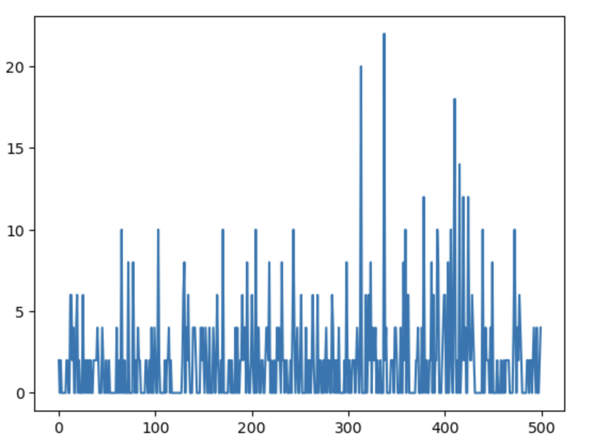

# Apache Spark Preemptive Auto-Scaling using Machine Learning

In this post I am going to show how we can use machine learning
techniques to scale Spark standalone cluster up or down. This 
technique can be used to preemptively scale cluster to meet 
upcoming loads so we can meet SLA requirements.
Please note that I am mainly going to focus on how we make automatic decisions to scale
up or down based on demands and less focus on technical parts as how to add a new node to 
a cluster etc. For that please see my other posts.

## Overview 
**The main idea in this technique is to use historic load patters from logs 
for given week day and time of the day and train an ML model that will learn the load patters and
can accurately predict cluster size that we can use to call an API (Rest API, docker etc.)
to scale the cluster up or down as needed.**

Below layout is written in Jupiter notebook style and you can get actual notebook at this
address : https://github.com/khalidmammadov/python_code/blob/master/ml_scale/scale_up_prediction_model.ipynb

## Set up
First import all required Python libraries
```python
import numpy as np
import matplotlib.pyplot as plt
import pandas as pd
from sklearn.ensemble import RandomForestClassifier
from sklearn import datasets
from sklearn.model_selection import train_test_split
```
- **numpy** here is needed for array manipulations
- **matplotlib** is for visualisation
- **pandas** for DataFrame operations
- **sklearn** for Machine Learning
- **RandomForestClassifier** and Random Forest classifier as a base of the model

## Generating simulated data
Lets first generate some sample data. I need to generate data that resembles 
a weekly patters of some typical workload that has got outliers as 
occasional peaks and normal loads. 

_Note: I am using generated data here for simplicity 
but in real implementation you will need to use your actual data from logs so 
it can learn your pattern._

**Here I will need to produce two arrays for X and Y axis that represent week day-time and
job count respectively. We will also have one more array that will show what would our 
desired cluster size would be in this case.**

First generate job count array and for that lets draw some sample data 
from a standard normal distribution
```python
scale = 500
s = np.random.standard_normal(size)
```

Then to remove negatives I will square and scale by two 
```python
scale = 2
y = np.round(np.power(s, 2)) * scale
```

Lets take a look how sample looks:
```
fig = plt.figure()
ax = fig.add_subplot()
ax.plot(y)
```


Next, generate X axis i.e. time of the day that matches how many
data points we have in the Y axis (again this is done for simplicity
of the example).

Here we say that during 24 hours we had various workloads
```
x = np.tile(np.arange(24), round(size/(24-1)))
x = x[:size]
x.shape

(500,)
```
## Function of desired cluster size
Now, we want to say that if our jobs is `n` then we want to 
have cluster nodes that is square root of that size and plus one to have at leas one node.
This is an example and you are free to set your or function to calculate it.
```python
z = np.round(np.sqrt(y)+1)
```

We then create a pandas DataFrame from it as a source dataset
for training:
```python
data = np.stack( (x, y, z), axis=-1)
df = pd.DataFrame(data, columns=["hour", "demand", "size"])
df
```
```bash
 	hour 	demand 	size
0 	0.0 	2.0 	2.0
1 	1.0 	0.0 	1.0
2 	2.0 	2.0 	2.0
3 	3.0 	0.0 	1.0
4 	4.0 	0.0 	1.0
... 	... 	... 	...
495 	15.0 	4.0 	3.0
496 	16.0 	0.0 	1.0
497 	17.0 	0.0 	1.0
498 	18.0 	2.0 	2.0
499 	19.0 	4.0 	3.0

500 rows × 3 columns
```

## Model training
We split and data into training and test datasets:
```python
X = df[["hour", "demand"]]
Y = df["size"]
X_train, X_test, y_train, y_test = train_test_split(X, Y, test_size=0.3) # 70% training and 30% test
```

Now, we train the model using Random Forest classifier
```python
clf=RandomForestClassifier(n_estimators=100)
clf.fit(X_train,y_train)
y_pred=clf.predict(X_test)
```

## Validation
Then important step in the model build process is to verify
how model is performing on the test data set:
```
# Model Accuracy, how often is the classifier correct?
print("Accuracy:",metrics.accuracy_score(y_test, y_pred))
```
`Accuracy: 0.9733333333333334
`

So, 97% percent accuracy is quite good. 


We can now generate a brand new sample data using above approach 
and use the same model to predict the results and see 
how model performs on a new data:
```python
ss = np.random.standard_normal(size)
yy = np.round(np.power(ss, 2)) * 2
xx = np.tile(np.arange(24), round(size/(24-1)))
xx = xx[:size]
xx.shape
zz = np.round(np.sqrt(yy)+1)
data_check = np.stack( (xx,yy, zz), axis=-1)
df_check = pd.DataFrame(data_check, columns=["hour", "demand", "size"])

yy_pred=clf.predict(df_check[["hour", "demand"]])
print("Accuracy:",metrics.accuracy_score(df_check["size"], yy_pred))
```
`Accuracy: 0.974
`

Again, 97% accuracy is quite good.

We can also visually observe the predicted values:
```python
pd.concat([df_check, pd.Series(yy_pred)], axis=1) 
```

```
 	hour 	demand 	size 	0
0 	0.0 	0.0 	1.0 	1.0
1 	1.0 	0.0 	1.0 	1.0
2 	2.0 	6.0 	3.0 	3.0
3 	3.0 	2.0 	2.0 	2.0
4 	4.0 	0.0 	1.0 	1.0
... 	... 	... 	... 	...
4995 	3.0 	0.0 	1.0 	1.0
4996 	4.0 	0.0 	1.0 	1.0
4997 	5.0 	2.0 	2.0 	2.0
4998 	6.0 	2.0 	2.0 	2.0
4999 	7.0 	2.0 	2.0 	2.0

5000 rows × 4 columns
```

## Preemptive scale up or down

Here scale up and down is the same process with the exception that
when we scale down we may want to to additional checks to avoid 
disruptions for currently running jobs if nodes are evicted.

### Scale up
Now, if we want to know how many cluster nodes we want to predict 
next hour we would need to shift forward the X axis variable (time of the day) 
by 1 hour and ask model to suggest and then we call a Rest API or other method
to scale the cluster accordingly. 

### Scale down
To scale down we would need again as in scale up phase, 
shift an hour and ask ML model to predict expected node count
and additionally based on current load you may want to scale down or leave 
for a while and check later again to avoid disruptions as Spark would 
need to recalculate an RDD if the worker nodes with executors are evicted.

## Conclusion
This code then can be embedded to a microservice to 
serve predictions given input variable like week day and hour as well as 
do periodic learning if you want to keep model uptodate.

This post demonstrates that we should be able to use ML 
techniques to solve Data Engineering problems as well 
and as you can see it's not too complicated. 
